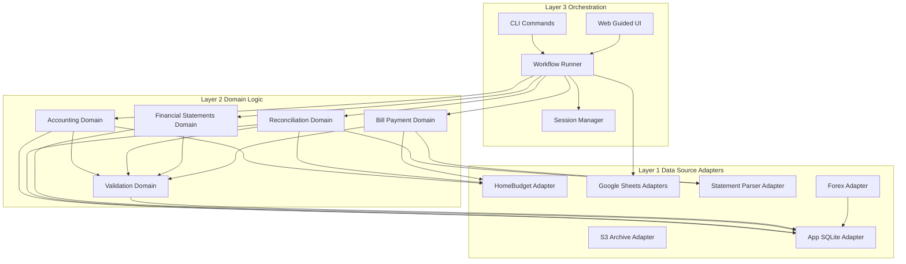

# Application Architecture Design

## Table of contents

- [Overview](#overview)
- [Design assumptions and open items](#design-assumptions-and-open-items)
- [Architecture goals](#architecture-goals)
- [Design constraints](#design-constraints)
- [Layered module model](#layered-module-model)
- [Primary orchestration modes](#primary-orchestration-modes)
- [Core data flow](#core-data-flow)
- [Dependency rules](#dependency-rules)
- [Extension points](#extension-points)
- [Reference pattern alignment](#reference-pattern-alignment)
- [Source documentation incorporated](#source-documentation-incorporated)
- [Workbook deprecation timeline](#workbook-deprecation-timeline)

## Overview

This document defines the target architecture for the financial statements application. The architecture follows a three layer model with strict dependency direction, where source adapters sit at the bottom, domain modules are in the middle, and workflow orchestration is at the top.

The design objective is harmonization of existing systems, not reinvention of HomeBudget, Google Sheets, or statement provider systems.

## Design assumptions and open items

- Assumption, statement balance and transaction extracts remain available each period.
- Assumption, HomeBudget account names remain stable enough for mapping table approach.
- Open item, canonical parser output schema for every supported bank file type.
- Open item, web UI scope for phase one implementation boundaries.

## Architecture goals

- Keep statements as source of truth for balances and transaction reconciliation.
- Keep domain logic independent from storage providers and APIs.
- Support monthly close as ordered steps with explicit checkpoints.
- Support dual interface strategy, CLI first and web guided workflow second.
- Keep persistence lean with SQLite and minimal JSON sidecars.

## Design constraints

- Runtime environment is local Windows with Python 3.12 in `env/`.
- Existing HomeBudget and sqlite-gsheet packages are reused as is.
- Existing bank statement files are treated as external raw inputs.
- Existing Google Sheets are non-authoritative for statements and balances, but remain an operational raw source for cash expenses captured via linked Google Forms.
- State persistence uses local SQLite, with selective S3 backup and archive.
- Google Sheets credentials and config paths follow `docs/google-sheets.md`.
- HomeBudget integration follows `docs/homebudget.md` and reference adapter patterns.

## Layered module model



### Layer 1, data source adapters

- `homebudget_adapter`, HomeBudget read and write through wrapper and direct query support.
- `cash_expense_sheet_adapter`, operational read path for cash-expense raw source (`Google Forms -> Google Sheets`).
- `legacy_workbook_adapter`, helper workbook reads for parity and controlled backfill only.
- `statement_parser_adapter`, CSV, XLSX, and PDF extraction into canonical transaction rows.
- `forex_adapter`, monthly end rate fetch and cache update.
- `app_db_adapter`, financial statements SQLite read and write.
- `s3_adapter`, backup and report upload operations.

### Layer 2, domain logic

- `accounting_domain`, booking rules, cost center logic, account handling rules.
- `reconciliation_domain`, transaction matching, variance computation, decision capture.
- `financial_statements_domain`, trial balance and statement aggregation.
- `bill_payment_domain`, bill parsing and shared allocation.
- `validation_domain`, reusable schema and business validation.

### Layer 3, orchestration

- `workflow_runner`, step graph execution and checkpoint control.
- `cli_module`, user commands for stepwise runs and period actions.
- `web_module`, guided runbook style flow that calls the same runner.
- `session_manager`, persisted step status and resume state.
- `review_publisher`, optional summary publication to Google Sheets for user review.

## Primary orchestration modes

- Mode 1, CLI step commands with checkpoints.
- Mode 2, web guided runbook that drives the same step interfaces.

Both modes use the same runner and session store so behavior and audit output stay consistent.

## Core data flow

```text
Period Input
→ Parallel acquisition from statements, HomeBudget, Sheets, forex, user input
→ Domain normalization and account mapping
→ Reconciliation and variance resolution
→ Statement generation and review output
→ Finalization to SQLite snapshot, JSON decisions, S3 archive
```

## Dependency rules

- Orchestration can call domain and adapter layers.
- Domain can call adapter layer through interfaces only.
- Adapter layer cannot call domain or orchestration.
- Cross domain calls are only through explicit service interfaces.
- Validation contracts are shared and versioned.

## Extension points

- New bank parser, add parser class that implements statement parser interface.
- New account type behavior, add account handler strategy in accounting domain.
- New workflow step, register a step contract and validation gate in runner.
- New reporting output, add renderer adapter while reusing statement domain model.

## Workbook deprecation timeline

- Phase A, parity mode default enabled while SQLite outputs are validated against helper workbook results.
- Phase B, parity mode opt-in only and production workflow defaults to workbook-free execution for non-cash domains.
- Phase C, backfill mode remains available for controlled historical replay only.
- Phase D, operational workbook reads are removed from monthly close run path except cash-expense intake; publication-only support remains available for summary review output.

## Reference pattern alignment

- `reference/hb-finances/database.py`, adapter style data access and sheet range mapping.
- `reference/hb-reconcile/src/reconcile/reconcile.py`, separation of load, compute, heuristic, and output phases.
- `gsheet/financial-statements.json`, stable range driven data contracts.

## Source documentation incorporated

- `docs/about.md`, product scope and local first MVP framing.
- `docs/current-workflow.md`, current manual sequential close structure.
- `docs/develop/design/app-workflows.md`, intended automated workflow design and checkpoint posture.
- `docs/accounting-logic.md`, transaction logic, uniqueness key, and reconciliation principles.
- `docs/account-classification.md`, HomeBudget account type behavior and reporting asset mapping.
- `docs/bill-payment.md`, shared cost allocation and settlement account usage.
- `docs/cash-reconcile.md`, cash gap equation and manual checkpoint expectations.
- `docs/google-sheets.md`, credential and workbook configuration assumptions.
- `docs/homebudget.md`, HomeBudget adapter integration context.
- `docs/dependencies.md`, sqlite gsheet dependency boundary.
- `docs/mvp-design.md`, local orchestration and S3 reporting constraints.
- `.github/prompts/plan-closing-design.prompt.md`, source quality controls and workbook structure assumptions.
- `docs/develop/design/financial-statements-spec.md`, report outputs and statement hierarchy constraints.

