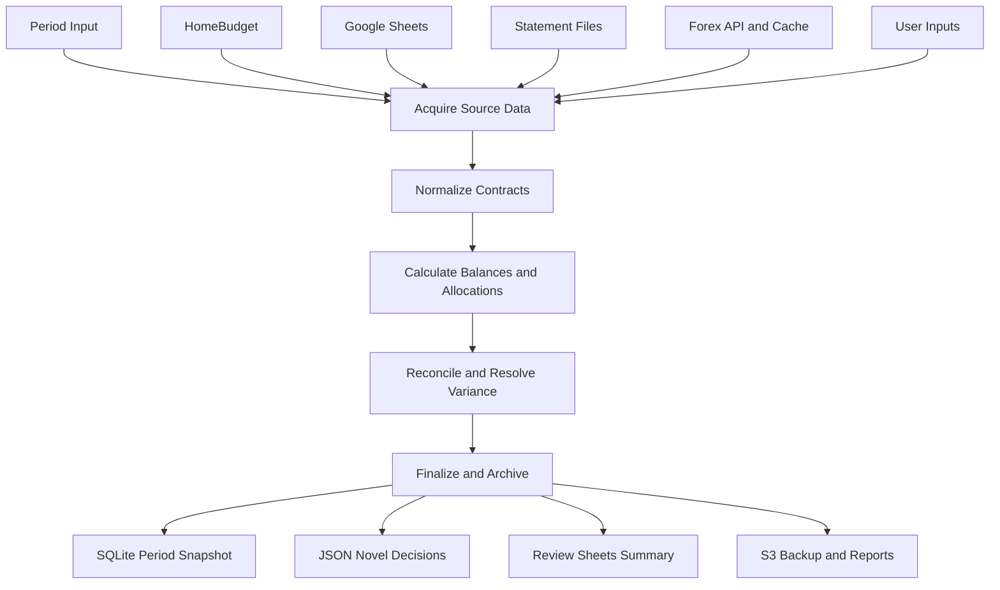

# Data Flow and Transformation Boundaries

## Table of contents

- [Overview](#overview)
- [Input sources](#input-sources)
- [Canonical data contracts](#canonical-data-contracts)
- [Flow stages](#flow-stages)
- [Validation gates](#validation-gates)
- [Output targets](#output-targets)
- [Failure handling by boundary](#failure-handling-by-boundary)
- [Manual checkpoints](#manual-checkpoints)

## Overview

This document defines end to end data movement for monthly close, from source ingestion to finalized period snapshot. Boundaries are explicit so each stage has clear responsibilities and failure behavior.

## Input sources

- HomeBudget ledger and account metadata via adapter calls.
- Bank statement files in CSV, XLSX, and PDF form.
- Forex rates from external provider and local archive.
- User supplied period inputs from `data/monthly-closing/inputs.json`.
- Cash expense stream from linked Google Form via linked Google Sheet workbook as documented in `docs/cash-reconcile.md`.

## Canonical data contracts

- `CanonicalAccount`, source names, mapped id, type, currency, owner.
- `CanonicalTransaction`, source id, account id, date, amount, currency, direction, description.
- `CanonicalBalance`, account id, period, opening, closing, source timestamp.
- `CanonicalRate`, rate_date, pair, rate, source.
- `CanonicalDecision`, variance record, explanation, resolution, novelty flag.

## Flow stages

### Stage 1, acquisition

- Pull HomeBudget account and transaction slices for period.
- Read cash-expense raw rows from Google Sheets (`Google Forms -> Google Sheets`) for cash reconciliation.
- Read other configured helper ranges from Google Sheets only when parity_mode or backfill_mode is enabled.
- Parse statement files into source transaction tables.
- Fetch period forex rates and merge with local archive.
- Load user inputs and confirmations.

### Stage 2, normalization

- Enforce date format and period bounds.
- Normalize account names using mapping table.
- Convert signed amount conventions to one canonical model.
- Set precision by currency and round at contract boundaries.
- Tag source lineage fields for traceability.

### Stage 3, calculations

- Compute opening and expected closing balances.
- Calculate balance deltas by account and source.
- Compute forex revaluation support values.
- Compute shared cost allocations.
- Compute cash residual gap using the documented equation from `docs/cash-reconcile.md`.

### Stage 4, reconciliation

- Match statement and ledger transactions.
- Isolate unmatched rows and derive proposed edits.
- Compute residual variance by account.
- Apply tolerance rules and classify variance status.
- Capture novel manual decisions only.

### Stage 5, finalization

- Persist period snapshot to app database.
- Persist novel decisions JSON for the period.
- Optionally publish summary outputs to review sheets.
- Archive DB backup and report artifacts to S3.

## Validation gates

- Gate A, all required sources loaded for period.
- Gate B, canonical schema and mapping validation passes.
- Gate C, reconciliation complete or documented exceptions approved.
- Gate D, generated statements and totals pass consistency checks.

## Output targets

- `financial_statements.db`, `period`, `account_balance`, `workflow_log`, `reconciliation_variance`, and `exchange_rate` records.
- `data/monthly-closing/YYYY-MM/reconciliation-decisions.json`, novel decisions only.
- `data/monthly-closing/YYYY-MM/financial-statements.json`, optional export snapshot.
- Google Sheets summary ranges for user review and analysis.
- S3 storage path by year and month for backup and reports.

Google Sheets contract note:

- `gsheet/cash-expenses.json` is an operational raw-source contract for cash reconciliation.
- Other workbook and range configuration in `gsheet/*.json` is used for parity/backfill and optional review publication.

## Failure handling by boundary

- Acquisition failures are fatal for missing mandatory sources.
- Normalization schema failures are fatal and require source correction.
- Calculation invariant failures are fatal and require investigation.
- Reconciliation variance over tolerance is recoverable with checkpoint review.
- Finalization write failures are recoverable with retry and transaction rollback.

## Manual checkpoints

- After acquisition, user confirms source completeness.
- After reconciliation, user reviews unresolved or waived variances.
- Before final close, user approves statement outputs.
