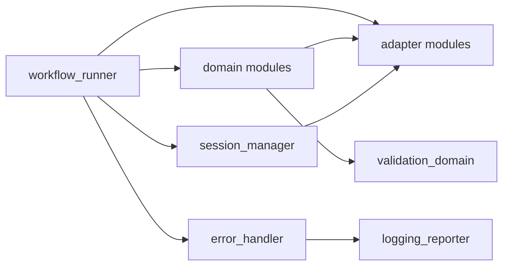

# Module Interface Design

## Table of contents

- [Overview](#overview)
- [Layer taxonomy](#layer-taxonomy)
- [Domain module contracts](#domain-module-contracts)
- [Adapter module contracts](#adapter-module-contracts)
- [Orchestration and support contracts](#orchestration-and-support-contracts)
- [Interaction and dependency map](#interaction-and-dependency-map)
- [Extensibility patterns](#extensibility-patterns)
- [Testing strategy by module](#testing-strategy-by-module)

## Overview

This document defines module boundaries and stable interfaces. The design keeps domain logic isolated from source details and provides clear extension seams for new statement formats, account behaviors, and reporting outputs.

Dependency baseline aligns with `docs/dependencies.md`, using sqlite gsheet for sheet access and existing HomeBudget integration patterns from `docs/homebudget.md`.

For detailed reconciliation behavior by account category and account type, refer to `docs/accounting-logic.md` in section `Reconciliation` and subsection `Reconciliation methods by account type`.

## Layer taxonomy

### Layer 1, adapter modules

- `homebudget_adapter`
- `cash_expense_sheet_adapter`
- `legacy_workbook_adapter`
- `statement_adapter`
- `forex_adapter`
- `storage_adapter`
- `s3_adapter`

### Layer 2, domain logic modules

- `accounting_domain`
- `reconciliation_domain`
- `financial_statements_domain`
- `bill_payment_domain`
- `validation_domain`

### Layer 3, orchestration and support

- `workflow_runner`
- `cli_module`
- `session_manager`
- `error_handler`
- `config_manager`
- `logging_reporter`

## Domain module contracts

### AccountingDomain

- Purpose, booking and account behavior rules.
- Input, canonical transactions and account metadata.
- Output, validated booking instructions and balance deltas.

```python
class AccountingDomain:
    def booking_prepare(self, transactions, accounts, period):
        """Return posting instructions and account deltas for period."""
```

### ReconciliationDomain

- Purpose, account reconciliation with account-type-specific strategies.
- Input, parsed statement rows, statement observed closing balance, ledger rows (for stage 2), opening balance, tolerance.
- Output, matches, unmatched rows, edits, and residual variance.
- Implementation, base reconciliation for statement digital twin verification, specialized ledger reconciliation for stage-2 transaction matching.

```python
class ReconcileBase:
    def statement_twin_reconcile(self, account_id, period, parsed_statement_rows, observed_closing_balance, tolerance):
        """Stage 1: import statement rows into digital twin and verify observed closing balance integrity."""

class ReconcileLedger(ReconcileBase):
    def transaction_reconcile(self, account_id, period, ledger_rows, statement_rows, opening_balance, tolerance):
        """Stage 2: match HomeBudget ledger transactions against statement twin rows and generate edits."""

class ReconcileBank(ReconcileLedger):
    """Backward-compatible alias for ReconcileLedger."""
```

Stage split:

- **Stage 1 (statement digital twin)**: Use `ReconcileBase` to import parsed transactions and verify statement closing balance.
- **Stage 2 (ledger reconciliation)**: Use `ReconcileLedger` to reconcile HomeBudget ledger rows against stage-1 statement rows.

Ownership note:

- Reconciliation strategies are domain-level behaviors owned by `reconciliation_domain`, not adapter modules.

**Reconciliation complexity by account type**:

- **High volume bank accounts and credit cards**: Stage 1 with `ReconcileBase`, then stage-2 transaction-level matching with `ReconcileLedger`.
- **Low volume bank accounts**: Stage 1 with `ReconcileBase`, then lighter stage-2 matching with `ReconcileLedger`.
- **IBKR brokerage accounts**: Stage 1 statement-driven posting and closing-balance verification with `ReconcileBase`; stage 2 optional depending on workflow mode.
- **CPF retirement accounts**: Stage 1 predictable contribution and interest verification with `ReconcileBase`; stage 2 optional depending on workflow mode.
- **Physical cash wallets**: Balance gap calculation with adjustment transaction. Uses `ReconcileBase`.
- **Digital wallets**: Balance verification with manual investigation path for unexplained gaps. Uses `ReconcileBase`.

See `docs/accounting-logic.md` for authoritative account-level reconciliation method details.

### FinancialStatementsDomain

- Purpose, trial balance and statement generation.
- Input, finalized balances and classification mapping.
- Output, report payloads for income statement and balance sheet.

```python
class FinancialStatementsDomain:
    def report_generate(self, period, balances, mapping, rates):
        """Return statement payloads for review and archival."""

    def fx_revaluation_apply(self, period, foreign_balances, rates):
        """Own reporting-currency conversion and month-end revaluation adjustments."""
```

### BillPaymentDomain

- Purpose, bill parsing flow, shared allocation, and posting package creation.
- Input, bill records, mapping rules, shared allocation rules.
- Output, posting package and consumption records.

```python
class BillPaymentDomain:
    def posting_package_build(self, period, parsed_bills, allocation_rules):
        """Return expense and settlement posting package."""
```

### ValidationDomain

- Purpose, shared validation contracts.
- Input, typed domain payloads.
- Output, pass or fail result with issue list.

```python
class ValidationDomain:
    def payload_validate(self, payload, contract_name):
        """Return validation result for contract."""
```

## Adapter module contracts

### HomeBudgetAdapter

- Read accounts and transactions
- Write approved postings with dedupe checks

### LegacyWorkbookAdapter

- Read helper ranges only in parity_mode or backfill_mode
- Never used as system of record for production monthly close
- Load credential and workbook mapping from documented config locations

### CashExpenseSheetAdapter

- Read cash expense rows from the linked Google Form workbook (`gsheet/cash-expenses.json`)
- Normalize form records to canonical cash expense transactions for reconciliation
- Treated as operational raw source for cash reconciliation

### ReviewPublisherAdapter

- Publish optional summary outputs to Google Sheets for user review
- Does not participate in reconciliation or persistence authority

### StatementAdapter

- Parse source files into canonical rows
- Expose parser specific diagnostics

### ForexAdapter

- Fetch monthly rates
- Read and update local archive

### StorageAdapter

- Manage SQLite operations and migrations
- Enforce transactional writes for checkpoint outputs

### S3Adapter

- Upload backups and report artifacts
- Return operation status for workflow logs

## Orchestration and support contracts

### WorkflowRunner

- Owns step sequencing and checkpoint decisions.
- Calls domain services and adapters through interfaces.

```python
class WorkflowRunner:
    def step_run(self, period, step_name):
        """Execute one step and persist status."""

    def checkpoint_run_until(self, period, checkpoint_name):
        """Execute in order until checkpoint gate."""
```

### SessionManager

- Creates and resumes period sessions.
- Persists step state and user decisions.

### ErrorHandler

- Normalizes exceptions to user facing outcomes.
- Supports retry advice and audit logging payloads.

### ConfigManager

- Loads JSON configuration and validates required keys.

### LoggingReporter

- Writes structured execution logs and summary reports.

## Interaction and dependency map



Dependency rule, no adapter can call domain or orchestration modules.

## Extensibility patterns

- Parser extension, register a new parser class and contract tests.
- Account behavior extension, add strategy implementation keyed by account type.
- Statement line extension, update mapping configuration before code changes.

## Testing strategy by module

- Domain modules, unit tests with fixture payloads and deterministic outputs.
- Adapter modules, integration tests with sandbox data and mock credentials.
- Orchestration modules, workflow step tests with checkpoint assertions.
- End to end smoke tests, period run with sample data and expected artifacts.