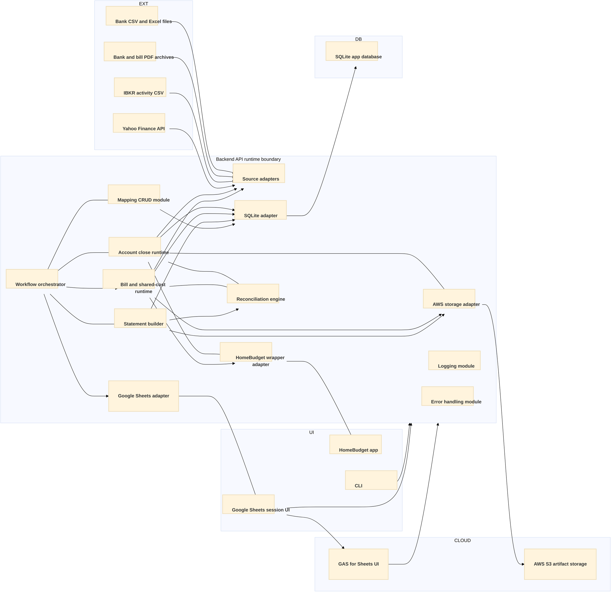

# System Architecture

## Summary

This document defines the POC system architecture and describes the end-to-end component model from raw external data sources through local processing to the Google Sheets review interface and HomeBudget write-back paths.

The architecture is local-first, single-user, and session-based. Google Sheets is the primary session UI, HomeBudget remains the operational ledger UI, and local SQLite is the canonical application persistence layer for close-cycle state and outputs.
S3 is an external artifact and archive integration for publish and lineage evidence handling.
Google Sheets adapter is the primary app-owned integration boundary for sheet read and write operations, while GAS is an optional UI enhancement limited to a small set of user-triggered click events.

## Table of contents

- [Architecture scope](#architecture-scope)
- [Architecture principles](#architecture-principles)
- [Workflow runtime placement](#workflow-runtime-placement)
- [System component catalog](#system-component-catalog)
- [System architecture diagram](#system-architecture-diagram)
- [Component specifications](#component-specifications)
  - [1. Bank source files](#1-bank-source-files)
  - [2. Bank and bill PDF archives](#2-bank-and-bill-pdf-archives)
  - [3. IBKR activity CSV](#3-ibkr-activity-csv)
  - [4. Yahoo Finance API](#4-yahoo-finance-api)
  - [5. AWS S3 artifact storage](#5-aws-s3-artifact-storage)
  - [6. Google Sheets session UI](#6-google-sheets-session-ui)
    - [6A. GAS for Sheets UI (optional)](#6a-gas-for-sheets-ui-optional)
  - [7. HomeBudget app](#7-homebudget-app)
  - [8. CLI](#8-cli)
  - [9. Backend API](#9-backend-api)
  - [10. AWS storage adapter](#10-aws-storage-adapter)
  - [11. Workflow orchestrator](#11-workflow-orchestrator)
  - [12. Account close runtime](#12-account-close-runtime)
  - [13. Bill and shared-cost runtime](#13-bill-and-shared-cost-runtime)
  - [14. Source adapters](#14-source-adapters)
  - [15. HomeBudget wrapper adapter](#15-homebudget-wrapper-adapter)
  - [16. Mapping CRUD module in backend API](#16-mapping-crud-module-in-backend-api)
  - [17. SQLite adapter](#17-sqlite-adapter)
    - [17A. Google Sheets adapter](#17a-google-sheets-adapter)
  - [18. Reconciliation engine](#18-reconciliation-engine)
  - [19. Statement builder](#19-statement-builder)
  - [21. SQLite app database and schemas](#21-sqlite-app-database-and-schemas)

## Architecture scope

In scope:

- External source systems and raw source artifacts required by monthly close.
- Ingestion, normalization, reconciliation, statement, and publishing backend components.
- Local SQLite schemas and lineage boundaries.
- Primary and parallel user surfaces, Google Sheets, HomeBudget, and CLI.

Out of scope:

- Cloud deployment of app services and multi-user coordination.
- Browser-first UI replacement for Google Sheets.
- Distributed processing or remote database hosting.

## Architecture principles

- Local-first operation with SQLite as app-owned persistence.
- SQLite adapter is the only SQL interface boundary for all SQLite schema access.
- Source-authority aware processing, external sources remain authoritative where defined by requirements.
- Deterministic close outputs from a controlled stage model and canonical close_book schema.
- Wrapper-boundary integration for HomeBudget reads and writes.
- Google Sheets as session UI, not canonical storage.
- Google Sheets adapter is the primary integration boundary for application-driven sheet updates and event write-back.
- GAS is optional and limited to select user-triggered click events; core close orchestration does not require GAS.
- Dual reachability is allowed: direct Google Sheets to backend API contracts and GAS-mediated event calls may coexist.
- IMPORTRANGE-based data imports remain a sheet-native mechanism and are outside GAS trigger scope.
- S3 is used for artifact storage and archive integration without changing local deployment boundaries.

## Workflow runtime placement

- Workflow orchestrator owns stage routing, dependencies, and checkpoint enforcement.
- Workflow-specific execution logic runs in runtime modules hosted inside the Backend API boundary.
- Account ingest and reconcile logic runs in the account close runtime.
- Bill payment and shared-cost logic runs in the bill and shared-cost runtime.
- Google Sheets adapter handles app-initiated sheet read and write operations, including workflow event write-back.
- GAS, when enabled, handles only selected click-driven event triggers and routes them through backend API contracts.
- Runtime modules never read or write SQLite directly; all persistence goes through Backend API SQL interfaces.

## System component catalog

| id | component                     | layer               | primary role                                |
| -- | ----------------------------- | ------------------- | ------------------------------------------- |
| 01 | bank source files             | external source     | bank CSV and Excel transaction inputs       |
| 02 | bank PDF archive              | external source     | statement evidence and audit artifact source |
| 03 | ibkr activity CSV             | external source     | broker activity input for IBA and IRA       |
| 04 | bill statement PDFs           | external source     | bill-domain source records                  |
| 05 | yahoo finance api             | external source     | forex and market pricing input              |
| 06 | aws s3 artifact storage       | external source     | artifact archive and publish storage        |
| 07 | google sheets session UI      | user interface      | primary close-session input and review      |
| 07A | gas for sheets ui            | user interface      | optional click-event trigger bridge for sheets workflows |
| 08 | homebudget app                | user interface      | operational ledger UI and review surface    |
| 09 | CLI                           | user interface      | parallel automation and review interface    |
| 10 | backend api                   | backend service     | service contract for UI and automation      |
| 11 | aws storage adapter           | api internal module | adapter boundary for S3 integration       |
| 12 | workflow orchestrator         | api internal module | stage routing and checkpoint enforcement  |
| 13 | account close runtime         | api internal module | account ingest and reconcile execution     |
| 14 | bill and shared-cost runtime  | api internal module | bill payment and shared-cost execution    |
| 15 | source adapters               | api internal module | source-specific extraction and normalization|
| 16 | homebudget wrapper adapter    | api internal module | HomeBudget read and write integration     |
| 17 | mapping CRUD module           | api internal module | governed mapping lifecycle management     |
| 18 | sqlite adapter                | api internal module | single SQL gateway for sqlite schemas     |
| 18A | google sheets adapter        | api internal module | primary sheet read/write and UI write-back boundary |
| 19 | reconciliation engine         | api internal module | matching, variance, tolerance, adjustment |
| 20 | statement builder             | api internal module | income statement, balance sheet, and artifact publish |
| 21 | logging module                | api internal module | shared runtime logging and audit events   |
| 22 | error handling module         | api internal module | shared error policy and exception mapping |
| 23 | sqlite app database           | local persistence   | app-owned schemas and lineage anchors       |

## System architecture diagram

## Component specifications

### 1. Bank source files

Functional specification:

- Provide monthly bank transaction data in account-specific CSV or Excel formats for in-scope statement-process accounts.

Constraints:

- Input shape is bank-specific and must be adapted through account profiles.
- Manual download by user is required during data ingest.

Requirement alignment:

- requirements/bank-statements.md
- requirements/source-systems-lineage.md

Interfaces:

- Outbound: source adapters.
- Lineage anchor: source file name, source row index, and extracted transaction keys.

### 2. Bank and bill PDF archives

Functional specification:

- Retain statement and bill evidence artifacts for audit and traceability during close.

Constraints:

- PDF is evidence input, not the primary transaction parse path for statement-process accounts.
- Files must remain available for period-close audit review.

Requirement alignment:

- requirements/bank-statements.md
- requirements/source-systems-lineage.md

Interfaces:

- Outbound: source adapters for archive registration and evidence references.

### 3. IBKR activity CSV

Functional specification:

- Provide period broker activity data used for top-down IBA and IRA derivation.

Constraints:

- Section-based CSV format requires integration-specific extraction rules.
- Manual download remains required in POC.

Requirement alignment:

- requirements/ibkr-integration.md
- requirements/source-systems-lineage.md

Interfaces:

- Outbound: source adapters.

### 4. Yahoo Finance API

Functional specification:

- Provide forex rates and market pricing inputs used by close-cycle valuations.

Constraints:

- External API reliability and latency are outside app control.
- Quotes must be stored with fetch timestamp and source symbols.

Requirement alignment:

- requirements/source-systems-lineage.md
- requirements/workflow-orchestration.md

Interfaces:

- Outbound: source adapters.

### 5. AWS S3 artifact storage

Functional specification:

- Store published statement artifacts and lineage evidence snapshots used by publish and audit workflows.

Constraints:

- S3 integration is an external storage dependency and does not imply cloud deployment of app services.
- Bucket identifiers and credentials must be referenced by config key and secret path, not literal values.

Requirement alignment:

- requirements/statements-lifecycle.md
- requirements/interaction-approvals.md
- requirements/exception-error-handling.md
- requirements/source-systems-lineage.md

Interfaces:

- Inbound: publish and archive payloads from AWS storage adapter.

### 6. Google Sheets session UI

Functional specification:

- Serve as the primary operator interface for close-session inputs, review checkpoints, and statement output review.

Constraints:

- UI workbook is a session surface only and not canonical app persistence.
- Workbook IDs must be configured by key and file path, not hardcoded in design text.
- Google Sheets may call backend API contracts directly for supported operations, and may also call through GAS for selected user-triggered actions.
- Sheet-native IMPORTRANGE data imports remain in-sheet operations and are not delegated to GAS.

Requirement alignment:

- requirements/user-interface.md
- requirements/google-sheets.md

Interfaces:

- Inbound: workflow status, app-initiated write-back events, and statement outputs from backend API through Google Sheets adapter.
- Outbound: user-entered inputs to backend API for ingest, mapping, and approvals, either directly or via optional GAS click-event routing.

### 6A. GAS for Sheets UI

Functional specification:

- Provide an optional event bridge for a small set of user-triggered click actions in Google Sheets UI.
- Operate as a UI integration runtime hosted in the cloud block of the architecture diagram.

Constraints:

- GAS scope is intentionally minimal and limited to selected click-driven actions.
- GAS is an enhancement path and not a required dependency for the main Google Sheets adapter interaction model.

Requirement alignment:

- requirements/user-interface.md
- requirements/google-sheets.md

Interfaces:

- Inbound: selected user-triggered events from Google Sheets UI.
- Outbound: backend API contract calls for approved click-event actions.

### 7. HomeBudget app

Functional specification:

- Remain the operational personal-finance ledger interface and display approved adjustment outcomes.

Constraints:

- App integration must use wrapper boundary rather than direct DB product contracts.
- HomeBudget-specific posting patterns must be preserved.

Requirement alignment:

- requirements/homebudget.md
- requirements/reconciliation-engine.md

Interfaces:

- Inbound: approved adjustment write-back from HomeBudget wrapper adapter.
- Outbound: ledger reads through HomeBudget wrapper adapter.

### 8. CLI

Functional specification:

- Provide a parallel command surface for stage execution, review, and automation workflows.

Constraints:

- CLI must not become the exclusive completion path for close operations.
- CLI confirmations are required before destructive or commit actions.

Requirement alignment:

- requirements/user-interface.md
- requirements/interaction-approvals.md

Interfaces:

- Inbound and outbound: backend API.

### 9. Backend API

Functional specification:

- Expose service contracts for UI and CLI operations including workflow stage actions, mapping CRUD, read models, and direct module access within the API boundary.
- Host mapping CRUD as an internal API module, not as a standalone backend service boundary.
- Host workflow runtimes for account-close and bill/shared-cost execution as internal modules.
- Provide one backend API runtime boundary as the only external backend contract for Google Sheets UI, optional GAS bridge calls, and CLI; these callers may reach multiple internal modules through this boundary.

Constraints:

- Service boundaries must enforce input validation and deterministic contract behavior.
- API contracts must preserve requirement-level ownership boundaries across workflows.

Requirement alignment:

- requirements.md
- requirements/user-interface.md

Interfaces:

- Inbound: Google Sheets session UI direct calls, optional GAS-triggered calls, and CLI.
- Outbound: AWS storage adapter, workflow orchestrator, account close runtime, bill and shared-cost runtime, source adapters, HomeBudget wrapper adapter, mapping CRUD module, SQLite adapter, Google Sheets adapter, reconciliation engine, and statement builder.

SQL interface boundary:

- SQLite adapter is the single SQL execution boundary within the Backend API; all schema reads and writes are routed through it.

### 10. AWS storage adapter

Functional specification:

- Provide a dedicated adapter boundary for S3 artifact upload, retrieval, naming policy, and archive access from application services.

Constraints:

- All S3 SDK and bucket operations must be encapsulated in this adapter.
- S3 credentials and bucket identifiers must be supplied through environment keys and config paths.

Requirement alignment:

- requirements/statements-lifecycle.md
- requirements/interaction-approvals.md
- requirements/source-systems-lineage.md
- requirements/exception-error-handling.md

Interfaces:

- Inbound: account close runtime, bill and shared-cost runtime, and statement builder requests.
- Outbound: AWS S3 artifact storage operations and result payloads to requesting runtime modules.

### 11. Workflow orchestrator

Functional specification:

- Coordinate stage progression, route gates, and inter-stage dependencies from pre-flight through statement output.
- Evaluate mapping completeness gates before advancing into account-close and bill/shared-cost runtime stages.

Constraints:

- Stage ordering and gate conditions follow workflow orchestration requirements.
- Stage progression must retain resumable and auditable checkpoint state.
- Orchestrator coordinates runtime invocation and must not embed domain-specific reconcile or bill-settlement logic.

Requirement alignment:

- requirements/workflow-orchestration.md
- requirements/interaction-approvals.md

Interfaces:

- Inbound: Google Sheets and CLI workflow actions through Backend API boundary routing.
- Outbound: Google Sheets adapter for app-initiated event write-back, mapping CRUD module for mapping completeness gate checks, account close runtime, bill and shared-cost runtime, and statement builder.

### 12. Account close runtime

Functional specification:

- Execute account-group workflow runtime logic for ingest, normalization, and reconciliation initiation for bank, IBKR, CPF, cash, and related account paths.

Constraints:

- Runtime executes within Backend API boundary and uses API-managed persistence interfaces only.
- Runtime must follow orchestrator stage and route-gate rules.

Requirement alignment:

- requirements/workflow-orchestration.md
- requirements/source-systems-lineage.md
- requirements/reconciliation-engine.md

Interfaces:

- Inbound: workflow orchestrator runtime invocation.
- Outbound: source adapters, reconciliation engine, HomeBudget wrapper adapter, SQLite adapter, and AWS storage adapter.

### 13. Bill and shared-cost runtime

Functional specification:

- Execute bill-payment and shared-cost workflow runtime logic, including bill parsing, lifecycle checks, settlement progression, and reconcile handoff.

Constraints:

- Runtime executes within Backend API boundary and uses API-managed persistence interfaces only.
- Bill lifecycle and shared-cost lifecycle remain independent except for bill amount dependency constraints.

Requirement alignment:

- requirements/bill-payment.md
- requirements/shared-costs.md
- requirements/reconciliation-engine.md

Interfaces:

- Inbound: workflow orchestrator runtime invocation.
- Outbound: source adapters, reconciliation engine, HomeBudget wrapper adapter, SQLite adapter, and AWS storage adapter.

### 14. Source adapters

Functional specification:

- Extract, normalize, validate, and stage source data from files, APIs, and manual inputs into app-owned schemas.

Constraints:

- Adapter rules are source-specific and deterministic.
- Idempotent ingest behavior is required for rerun safety.

Requirement alignment:

- requirements/source-systems-lineage.md
- requirements/bank-statements.md
- requirements/ibkr-integration.md
- requirements/cash-reconcile.md

Interfaces:

- Inbound: raw external sources and runtime triggers.
- Outbound: normalized payloads to SQLite adapter.

### 15. HomeBudget wrapper adapter

Functional specification:

- Handle all HomeBudget reads and controlled write-back operations through wrapper capabilities.

Constraints:

- Direct SQLite integration is diagnostic only, not product integration contract.
- Write-back requires approved reconciliation outcomes.

Requirement alignment:

- requirements/homebudget.md
- requirements/reconciliation-engine.md

Interfaces:

- Inbound: account close runtime and bill and shared-cost runtime invocation.
- Outbound: HomeBudget app and SQLite adapter sync payloads.

### 16. Mapping CRUD module in backend API

Functional specification:

- Manage category and account mapping lifecycle through governed CRUD operations inside the Backend API boundary.

Constraints:

- Mapping changes are event-driven and operate outside close-run sequencing.
- Must support validation and audit visibility for mapping updates.

Requirement alignment:

- requirements/user-interface.md
- requirements/transaction-categories.md
- requirements/data-model.md

Interfaces:

- Inbound: Backend API boundary mapping requests from Google Sheets and CLI, and workflow orchestrator mapping completeness gate checks.
- Outbound: mapping schema reads and writes via SQLite adapter.

### 17. SQLite adapter

Functional specification:

- Provide a single internal SQL gateway for all SQLite schema reads and writes.

Constraints:

- Domain modules must not execute direct SQL outside this adapter.
- SQL execution paths must be deterministic and auditable for close reruns.
- Adapter contracts must be backend-neutral and must not expose SQLite-specific behavior to calling modules.
- Transaction, query, and persistence operations must be expressed through stable adapter interfaces so that a cloud SQL adapter can replace the SQLite-backed implementation without caller-side contract changes.

Requirement alignment:

- requirements/data-model.md
- requirements/source-systems-lineage.md

Interfaces:

- Inbound: Backend API internal modules.
- Outbound: statements, hb, cash_staging, bills, mapping, close_book, and session and audit schemas.

### 17A. Google Sheets adapter

Functional specification:

- Serve as the primary backend boundary for Google Sheets read and write interactions required by workflow status publishing and app-initiated UI write-back.

Constraints:

- Adapter behavior must be deterministic and idempotent for stage reruns and repeat event publication.
- Adapter implementation must preserve workbook-level governance, including configured workbook key usage and controlled sheet and range access.
- Adapter handles the main bulk of Google Sheets interface operations; GAS remains optional and limited to selected click-event triggering.

Requirement alignment:

- requirements/google-sheets.md
- requirements/user-interface.md
- requirements/workflow-orchestration.md

Interfaces:

- Inbound: workflow orchestrator and backend API internal modules requiring app-driven sheet read/write operations.
- Outbound: Google Sheets session UI updates, status publishing, and event write-back payloads.

### 18. Reconciliation engine

Functional specification:

- Execute account-group matching methods, variance evaluation, tolerance checks, and adjustment generation.
- Execute book-level identity checks when invoked by statement builder to enforce financial statement integrity constraints, such as net income reconciling to change in net assets.

Constraints:

- Must support both transaction-level and balance-level method classes.
- Blocking variances and approval requirements must follow policy thresholds.

Requirement alignment:

- requirements/reconciliation-engine.md
- requirements/cash-reconcile.md
- requirements/source-systems-lineage.md

Interfaces:

- Inbound: account close runtime and bill and shared-cost runtime invocation with staged source data, and statement builder for book-level identity checks.
- Outbound: reconciliation outcomes and adjustment records to the invoking runtime module.

### 19. Statement builder

Functional specification:

- Produce period income statement and balance sheet outputs from reconciled close_book records.
- Execute book-level reconciliation checks through the reconciliation engine to enforce financial identity constraints.
- Generate and publish period artifacts to AWS S3 and finalize close-session completion after statement review.

Constraints:

- close_book is the exclusive aggregate source for statement outputs.
- Output generation must be reproducible for reruns of the same period state.
- Publish can execute only after statement stage success and required checkpoint completion.
- Close-session records must be append-only and traceable.

Requirement alignment:

- requirements/financial-statements.md
- requirements/data-model.md
- requirements/statements-lifecycle.md
- requirements/workflow-orchestration.md

Interfaces:

- Inbound: workflow orchestrator invocation, SQLite adapter close_book read model, and reconciliation engine for book-level identity checks.
- Outbound: reconciliation engine for book-level validation, SQLite adapter persistence events, and AWS storage adapter artifact events.

### 21. SQLite app database and schemas

Functional specification:

- Persist app-owned operational state, lineage anchors, mappings, staged inputs, reconciled records, and audit traces.

Constraints:

- Schema ownership boundaries follow data-model requirements.
- close_book remains the exclusive statement aggregation source.

Requirement alignment:

- requirements/data-model.md
- requirements/source-systems-lineage.md

Interfaces:

- statements schema: read and write through backend API only.
- hb sync schema: read and write through backend API only.
- cash_staging schema: read and write through backend API only.
- bills schema: read and write through backend API only.
- mapping schema: read and write through backend API only.
- close_book schema: read and write through backend API only.
- session and audit schema: read and write through backend API only.

Implementation note:

- In this architecture, all backend API schema access is executed through the SQLite adapter module.
