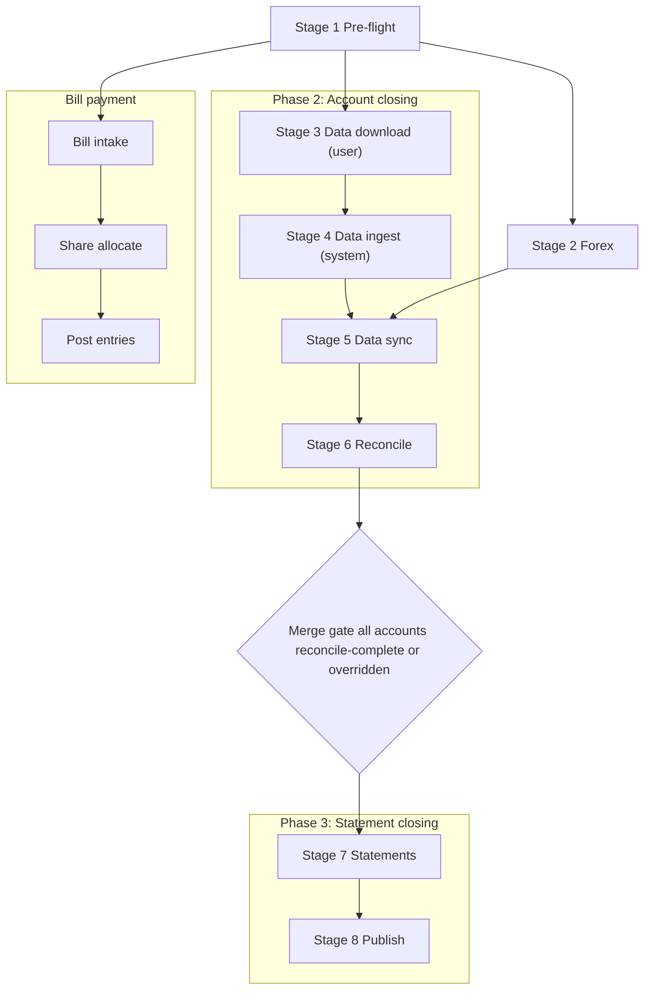

# Workflow Design

- [Summary](#summary)
- [Orchestration model](#orchestration-model)
- [Stage summary](#stage-summary)
- [Monthly close workflow](#monthly-close-workflow)
  - [Phase 1: Session setup](#phase-1-session-setup)
    - [Stage 1: Pre-flight](#stage-1-pre-flight)
  - [Phase 2: Account closing](#phase-2-account-closing)
    - [Stage 2: Forex](#stage-2-forex)
    - [Stage 3: Data download](#stage-3-data-download)
    - [Stage 4: Data ingest](#stage-4-data-ingest)
    - [Stage 5: Data sync](#stage-5-data-sync)
    - [Stage 6: Reconcile](#stage-6-reconcile)
    - [Merge gate](#merge-gate)
  - [Phase 3: Statement closing](#phase-3-statement-closing)
    - [Stage 7: Statements](#stage-7-statements)
    - [Stage 8: Publish](#stage-8-publish)
- [Bill payment workstream](#bill-payment-workstream)
  - [Step 1: Bill intake](#step-1-bill-intake)
  - [Step 2: Share allocate](#step-2-share-allocate)
  - [Step 3: Post entries](#step-3-post-entries)
  - [Step 4: Workstream close](#step-4-workstream-close)
- [Mapping maintenance workflow](#mapping-maintenance-workflow)
  - [Step 1: Classification review](#step-1-classification-review)
  - [Step 2: Mapping update](#step-2-mapping-update)
  - [Step 3: Gate check](#step-3-gate-check)

---

## Summary

This document defines the workflow design for the monthly close session. It covers every workflow in scope, organized by phase and stage, and for each stage documents inputs, components, transformations, user actions, validations, and possible errors.

The monthly close workflow is organized into three phases:

- **Phase 1: Session setup** — common; validates period, environment, and source readiness before committing the session.
- **Phase 2: Account closing** — account-level; all accounts run in parallel through data download, data ingest, data sync, and reconcile. Each account progresses independently. A merge gate collects all per-account outcomes before phase 3 begins.
- **Phase 3: Statement closing** — common; produces, reviews, and publishes the period statements.

Two additional workflows operate independently:

- **Bill payment workstream**: a parallel workstream that runs alongside the close session.
- **Mapping maintenance workflow**: an event-driven workflow that runs outside the close session.

## Orchestration model

The monthly close is an **account-level workflow**. Each account in scope has its own independent workflow state and progresses through phase 2 stages autonomously. Accounts are organized into account groups that define the workflow template, data source type, and reconcile method for member accounts. Account groups are a classification — accounts are the unit of orchestration.

| concept             | role                                                                                     |
| ------------------- | ---------------------------------------------------------------------------------------- |
| account             | the individual entity with its own workflow state; the unit of orchestration in phase 2  |
| account group       | a classification of accounts sharing a data source type and reconcile method             |
| phase 1 and phase 3 | common stages that run once per session, shared across all accounts                      |
| phase 2             | runs at the account level; each account progresses independently in parallel             |
| merge gate          | the convergence point before phase 3; all per-account reconcile outcomes must complete   |

Within phase 2, different accounts may be at different internal stages in parallel. For example, one bank account may be in data sync while another bank account is still completing data download. The orchestrator tracks per-account state and does not require lockstep advancement across accounts or across account groups.

## Stage summary

The tables below list all stages for each workflow. Step-level detail is in the stage sections below.

### Monthly close workflow

| phase                    | id | stage         | scope       | prerequisite                        |
| ------------------------ | -- | ------------- | ----------- | ----------------------------------- |
| phase 1: session setup   | 01 | pre-flight    | common      | user period select                  |
| phase 2: account closing | 02 | forex         | common      | pre-flight success                  |
| phase 2: account closing | 03 | data download | per account | pre-flight success                  |
| phase 2: account closing | 04 | data ingest   | per account | download ready for account          |
| phase 2: account closing | 05 | data sync     | per account | ingest complete + forex complete    |
| phase 2: account closing | 06 | reconcile     | per account | data sync route gate                |
|                          | MG | merge gate    | common      | all accounts reconcile-complete [1] |
| phase 3: stmt closing    | 07 | statements    | common      | merge gate                          |
| phase 3: stmt closing    | 08 | publish       | common      | statement review confirmed          |

- [1] Or explicitly overridden with logged rationale per account.

### Bill payment workstream

| id | stage           | prerequisite              |
| -- | --------------- | ------------------------- |
| 01 | bill intake     | pre-flight success        |
| 02 | share allocate  | bill intake complete      |
| 03 | post entries    | share allocate approved   |
| 04 | workstream close | all bills settled         |

### Mapping maintenance workflow

| id | stage                  | trigger                       |
| -- | ---------------------- | ----------------------------- |
| 01 | classification review  | user or gate block            |
| 02 | mapping update         | unmapped items identified     |
| 03 | gate check             | mapping updates applied       |

## Monthly close workflow

The monthly close workflow runs as a single orchestrated session. The workflow orchestrator owns stage routing, gate evaluation, and checkpoint enforcement. Runtime execution logic runs in account close runtime or bill and shared-cost runtime modules. All persistence goes through the SQLite adapter. All Google Sheets UI updates go through the Google Sheets adapter.

### Workflow diagram

Each node in phase 2 represents all accounts progressing through that stage independently. Account groups organize accounts by shared data source type and reconcile method but do not own stage state. The orchestrator tracks state at the individual account level.

---

### Phase 1: Session setup

Phase 1 validates that the session is ready to begin before committing the target period. It runs once and is common to all accounts.

---

### Stage 1: Pre-flight

**Objective:** Validate period selection, environment configuration, and source readiness before committing the close session.

#### Steps

| step | description                                                              |
| ---- | ------------------------------------------------------------------------ |
| 1.1  | user selects target period in Google Sheets session UI                   |
| 1.2  | orchestrator reads period selection from Google Sheets adapter           |
| 1.3  | backend validates period is not already finalized                        |
| 1.4  | environment configuration checked for required keys                     |
| 1.5  | source readiness checklist evaluated                                     |
| 1.6  | user confirms source readiness checkpoint in GS UI                      |
| 1.7  | pre-flight status recorded; orchestrator advances to forex and download  |

#### Inputs

| input               | source               | format          | characteristics                             |
| ------------------- | -------------------- | --------------- | ------------------------------------------- |
| target period       | Google Sheets UI     | YYYY-MM string  | user-entered; validated against session reg |
| environment config  | config file          | key-value store | required keys: db path, gsheet key, s3 path |
| prior period status | session_audit schema | SQLite record   | confirms prior period is not open           |

#### Components

| component                | role                                                          |
| ------------------------ | ------------------------------------------------------------- |
| Google Sheets session UI | presents period selector and source readiness checklist       |
| Google Sheets adapter    | reads user-entered period and checklist confirmation          |
| workflow orchestrator    | evaluates pre-flight gate and routes to next stages           |
| SQLite adapter           | reads session_audit for prior period state                    |
| backend API              | routes pre-flight request from GS UI                         |

#### Transformations and operations

- Period string is parsed and validated as a valid calendar month.
- Prior period state is queried from session_audit schema.
- Config key presence is verified; missing keys produce a config error.

#### User actions

- Select target period in GS session workbook.
- Confirm source readiness checklist items in GS session workbook.

#### Validations

- Target period must be a valid calendar month that has not already been finalized.
- Required environment config keys must be present and non-empty.
- Source readiness checklist confirmation must be recorded before exit.

#### Possible errors

| error                          | type     | behavior                                          |
| ------------------------------ | -------- | ------------------------------------------------- |
| period already finalized       | blocking | exits with error; user must select another period |
| missing environment config key | blocking | exits with config error; user must fix config     |
| checklist not confirmed        | blocking | stage does not advance until user confirms        |

---

### Phase 2: Account closing

Phase 2 runs at the account level. Each account in scope progresses independently through data download, data ingest, data sync, and reconcile. Forex runs in parallel with phase 2 as a common prerequisite for data sync. The merge gate at the end of phase 2 collects all per-account reconcile outcomes before phase 3 begins.

---

### Stage 2: Forex

**Objective:** Load and validate period exchange rates for all required currency pairs before data sync begins.

#### Steps

| step | description                                                       |
| ---- | ----------------------------------------------------------------- |
| 2.1  | orchestrator triggers forex stage after pre-flight success        |
| 2.2  | source adapter calls Yahoo Finance API for required currency pairs |
| 2.3  | API response validated; rates within expected range               |
| 2.4  | rates stored in forex rates store with fetch timestamp            |
| 2.5  | orchestrator records forex stage complete                         |

#### Inputs

| input                   | source             | format           |
| ----------------------- | ------------------ | ---------------- |
| required currency pairs | config / constants | list of FX pairs |
| forex API response      | Yahoo Finance API  | JSON via HTTP    |

- Required currency pairs are static for POC scope (SGD/USD, USD/SGD).
- Forex API response provides spot price and timestamp per pair; external reliability risk applies.

#### Components

| component             | role                                                         |
| --------------------- | ------------------------------------------------------------ |
| workflow orchestrator | triggers forex execution after pre-flight                    |
| source adapters       | executes Yahoo Finance API call and normalizes response      |
| SQLite adapter        | persists forex rates with fetch timestamp to forex store     |
| backend API           | hosts forex execution as part of account close runtime       |

#### Transformations and operations

- API response parsed to extract rate and timestamp per currency pair.
- Rates stored as decimal values with originating symbol pair and fetch timestamp.
- Rates used by data sync for FX-denominated account valuation and translation.

#### User actions

- No user action required unless rates fall outside expected range and need review.

#### Validations

- All required currency pairs must have a response.
- Rates must be within expected business plausibility range.
- Rates must be stored with non-null fetch timestamp.

#### Possible errors

| error                       | type     | behavior                                                     |
| --------------------------- | -------- | ------------------------------------------------------------ |
| API call fails or times out | blocking | forex exits with error; user may retry or enter rate manually |
| rate outside expected range | review   | flagged for user review; user must approve before forex exits |
| missing pair in response    | blocking | forex blocked until pair is resolved or manual override entered |

---

### Stage 3: Data download

**Objective:** Collect all source inputs per account. File-based accounts require the user to download source files to the Windows `Downloads/` directory. GS UI-based accounts require the user to enter data in the GS session workbook. Each account's data download completes independently when its required inputs are available.

Data download runs in parallel with forex after pre-flight. Accounts may reach download-ready status at different times and are not required to align.

#### Account data download paths

| account group | download method  | user action                                         |
| ------------- | ---------------- | --------------------------------------------------- |
| bank accounts | file download    | download CSV/Excel + PDF to Windows Downloads/      |
| IBKR          | file download    | download activity CSV to Windows Downloads/         |
| CPF           | GS UI entry      | enter OA, SA, MA, RA balances and period txns in GS workbook |
| cash          | GS UI entry      | enter close balance in GS workbook                  |
| wallets       | GS UI entry      | enter observed balance per wallet in GS workbook    |
| investments   | GS UI entry      | enter price and quantity per holding in GS workbook |
| others        | source-specific  | per account source declaration                      |

#### Steps

| step | description                                                              |
| ---- | ------------------------------------------------------------------------ |
| 3.1  | user downloads bank statement files from bank portals to Downloads/      |
| 3.2  | user downloads IBKR activity CSV from IBKR portal to Downloads/          |
| 3.3  | user enters CPF sub-account balances and period transactions in GS workbook |
| 3.4  | user enters close balance for cash accounts in GS session workbook       |
| 3.5  | user enters observed balances for wallet accounts in GS session workbook |
| 3.6  | user enters pricing and quantity for investment holdings in GS workbook  |
| 3.7  | orchestrator records per-account download-ready status as inputs arrive  |

#### Inputs

| input                           | source                        | format                |
| ------------------------------- | ----------------------------- | --------------------- |
| bank statement CSV or Excel     | bank portal download          | CSV or Excel [1]      |
| bank statement PDF              | bank portal download          | PDF                   |
| IBKR activity CSV               | IBKR portal download          | section-based CSV [2] |
| CPF sub-account balances        | GS session UI                 | user-entered numeric  |
| CPF period transactions         | GS session UI                 | user-entered rows     |
| cash close balance              | GS session UI                 | user-entered numeric  |
| wallet observed balance         | GS session UI                 | user-entered numeric  |
| investment pricing and quantity | GS session UI                 | user-entered numeric  |

- [1] Bank formats vary: CSV for DBS and Citi; Excel for UOB. Account-specific schema; encoding varies.
- [2] IBKR multi-section format; section headers delimit record types (trades, dividends, transfers, cash).
- CPF balances: OA, SA, MA, RA sub-accounts; SGD-denominated.
- CPF period transactions: MS deductors and YE interest payments entered as transaction rows; optional per period.
- Wallet balances: native currency per wallet (USD, SGD, etc.).
- Investment inputs: price in native currency and quantity per holding.

#### Components

| component                | role                                                       |
| ------------------------ | ---------------------------------------------------------- |
| Google Sheets session UI | presents GS UI entry forms per account group               |
| Google Sheets adapter    | reads user GS UI entries; passes to backend API            |
| workflow orchestrator    | tracks per-account download-ready status                   |
| backend API              | records download-ready status per account                  |

#### User actions

- Download bank statement files (CSV/Excel) and PDF archives to Windows Downloads/ directory.
- Download IBKR activity CSV to Windows Downloads/ directory.
- Enter CPF sub-account balances and any period transactions (MS deductors, YE interest) in GS session workbook.
- Enter cash close balance in GS session workbook.
- Enter wallet observed balances in GS session workbook.
- Enter investment pricing and quantity per holding in GS session workbook.

#### Validations

- No system validation occurs at the data download stage; validation is performed in data ingest.
- GS UI entries are recorded as submitted; correctness is validated in data ingest.

---

### Stage 4: Data ingest

**Objective:** System automatically detects source files placed in the Windows `Downloads/` directory, copies and renames them to the local ingest staging directory, validates format and period per account, and provides per-account feedback in the GS session UI. For GS UI-based accounts, system reads confirmed entries via GS adapter. Each account's data ingest begins independently as soon as its download-ready status is set.

Data ingest is fully app-driven. No user action is required once files are placed in Downloads/ or GS UI entries are submitted.

#### Steps

| step | description                                                                  |
| ---- | ---------------------------------------------------------------------------- |
| 4.1  | source adapter polls Downloads/ for new files matching account source patterns |
| 4.2  | system identifies and tags each detected file to an account and data source  |
| 4.3  | system copies and renames file to local ingest staging directory             |
| 4.4  | system validates file format, required structure, and period coverage        |
| 4.5  | for GS UI sources: system reads confirmed entries via GS adapter per account |
| 4.6  | system registers file lineage anchor: source path, account, period, timestamp |
| 4.7  | system writes per-account feedback to GS session UI: accepted or error       |
| 4.8  | orchestrator records ingest-complete status per account                      |

#### Inputs

| input                           | source                              | format                |
| ------------------------------- | ----------------------------------- | --------------------- |
| bank statement file             | Windows Downloads/ (source adapter) | CSV or Excel          |
| bank statement PDF              | Windows Downloads/ (source adapter) | PDF                   |
| IBKR activity CSV               | Windows Downloads/ (source adapter) | section-based CSV     |
| CPF sub-account entries         | GS adapter (from GS session)        | numeric per sub-acct  |
| cash close balance entry        | GS adapter (from GS session)        | numeric               |
| wallet balance entries          | GS adapter (from GS session)        | numeric per wallet    |
| investment pricing and quantity | GS adapter (from GS session)        | numeric per holding   |

#### Components

| component             | role                                                                              |
| --------------------- | --------------------------------------------------------------------------------- |
| source adapters       | polls Downloads/ for new files; identifies, tags, copies, and renames to staging |
| Google Sheets adapter | reads confirmed GS UI entries for UI-entry accounts                               |
| SQLite adapter        | records ingest events and file lineage anchors                                    |
| workflow orchestrator | tracks per-account ingest-complete status                                         |
| backend API           | hosts ingest detection and staging execution                                      |

#### Transformations and operations

- File detection: source adapter polls Downloads/ and matches files against account source profiles (name pattern, extension, size range).
- File tagging: matched file is associated to account and data source; tagging recorded in lineage log.
- File copy: original preserved in Downloads/; copy renamed to staging dir with deterministic name (account, period, file type).
- GS UI entries: read via Google Sheets adapter; staged as key-value records in session schema.
- No content transformation occurs during ingest; staging is format-preserving.

#### User actions

- None required. User reviews per-account feedback in GS session UI.
- If feedback shows period-mismatch or format-error, user must supply a corrected file or entry.

#### Validations

- Statement files: extension and internal structure must match account source profile.
- Statement files: period derived from content must match target period.
- IBKR CSV: required section headers must be present.
- GS UI entries: required fields must be non-null per account group.
- Cash form pull: system pulls cash form transactions; user must confirm zero-transaction period if pull is empty.

#### Possible errors

| error                                   | type     | behavior                                                                  |
| --------------------------------------- | -------- | ------------------------------------------------------------------------- |
| file not recognized by pattern match    | blocking | not staged; user must verify file and re-place                            |
| file format does not match profile      | blocking | staging rejected; user must supply correct format                         |
| period in file does not match target    | blocking | staging rejected; user must supply correct file                           |
| period file for account not found       | blocking | staging rejected for the account with user approval no txns in the period |
| GS UI entry missing for required field  | blocking | ingest blocked; user must complete entry                                  |
| cash form pull returns no records       | review   | user must confirm zero-transaction period                                 |

---

### Stage 5: Data sync

**Objective:** Process all staged ingest inputs, normalize and transform records, and populate app-managed schemas for each account. Data sync is app-driven after data ingest and forex are both complete for the account.

Each account progresses through data sync independently after its own ingest completes. Accounts within the same account group may be at different data sync states.

#### Steps

| step | description                                                                      |
| ---- | -------------------------------------------------------------------------------- |
| 5.1  | source adapter parses bank statement CSV or Excel into normalized transaction rows |
| 5.2  | source adapter parses IBKR activity CSV sections; derives NAV and activity records |
| 5.3  | CPF roll-forward computation applied to staged sub-account balances              |
| 5.4  | cash form transactions aggregated; close balance recorded                        |
| 5.5  | wallet observed balances recorded; FX translation applied at period-end rates    |
| 5.6  | investment pricing and quantity processed; valuation snapshot computed           |
| 5.7  | HomeBudget wrapper adapter syncs hb schema objects for the period                |
| 5.8  | transaction category dimensions refreshed from mapping schema                    |
| 5.9  | route gate closed per account; status persisted                                  |
| 5.10 | orchestrator confirms data sync complete for in-scope accounts                   |

#### Inputs

| input                              | source                       | format                  |
| ---------------------------------- | ---------------------------- | ----------------------- |
| staged bank statement file         | ingest staging directory     | CSV / Excel             |
| staged IBKR activity CSV           | ingest staging directory     | section-based CSV       |
| CPF staged entries                 | ingest staging (session)     | balances + txn rows     |
| cash form records                  | ingest staging (session)     | transaction rows        |
| wallet staged balances             | ingest staging (session)     | numeric per wallet      |
| investment staged inputs           | ingest staging (session)     | numeric per holding     |
| HomeBudget transaction and balance | HomeBudget wrapper adapter   | HB wrapper output       |
| forex rates                        | forex rates store (SQLite)   | decimal per pair        |
| category mapping                   | mapping schema (SQLite)      | `gl_code` per category  |

- Bank statement: account parsing profile applied per account; CSV or Excel depending on bank.
- IBKR CSV: sections are trades, dividends, transfers, and cash.
- CPF entries: OA, SA, MA, RA sub-account balances in SGD; period transactions (MS deductors, YE interest) as transaction rows when applicable.
- Cash form: transaction rows with date, description, amount, category.
- Wallet balances: translated to SGD using period-end forex rates.
- Investment inputs: valuation = price × quantity × FX rate; recorded as snapshot.
- HB wrapper output: `hb_gl_txn`, `hb_account_dim`, `hb_category_dim` schema objects.
- Forex rates: loaded in stage 2; prerequisite for wallet and investment valuation.
- Category mapping: completeness gate must pass before route gate can be set.

#### Components

| component                  | role                                                                        |
| -------------------------- | --------------------------------------------------------------------------- |
| account close runtime      | orchestrates per-account data sync execution                                |
| source adapters            | parses bank CSVs, Excel, IBKR CSV; normalizes to `statements` schema        |
| HomeBudget wrapper adapter | reads HB transactions and dimensions; populates `hb` sync schema            |
| reconciliation engine      | not yet invoked; route gate status derived by data sync                     |
| SQLite adapter             | persists normalized records and route gate status per account               |
| workflow orchestrator      | tracks data sync completion across all in-scope accounts                    |

#### Transformations and operations

- Bank CSV/Excel: columns mapped through account parsing profile; date parsed; amounts to decimal; sign normalized.
- IBKR CSV: sections separated by header marker; trades, dividends, and cash extracted; NAV derived from positions.
- CPF: roll-forward: beginning balance + contributions - withdrawals = ending balance per sub-account.
- Cash: transaction rows aggregated by category; close balance recorded; opening-to-close delta computed.
- Wallets: observed balance translated to SGD at period-end forex rate.
- Investments: valuation = quantity × price × forex rate; recorded as valuation snapshot in close_book schema.
- HomeBudget sync: `hb_gl_txn` refreshed for the period; `hb_account_dim` and `hb_category_dim` refreshed.
- Category mapping joined to `hb_gl_txn` to apply `gl_code` assignments.

#### User actions

- Data sync is fully app-driven once data ingest is complete.
- No user action required unless a route gate fails or a parsing error occurs.

#### Validations

- Bank adapter: column count and required field presence validated per account profile.
- Bank adapter: date range validated to fall within target period.
- Bank adapter: duplicate row detection using hash-based deduplication.
- IBKR adapter: required sections present; activity period matches target period.
- HB sync: required dimension tables are non-empty after sync.
- Category mapping: all active HB categories have `gl_code` entry before route gate can be set.
- Route gate set only when all required sync outputs for the account are complete and validated.

#### Possible errors

| error                                    | type     | behavior                                              |
| ---------------------------------------- | -------- | ----------------------------------------------------- |
| bank statement column mismatch           | blocking | parsing fails; verify format and re-place file        |
| bank statement date outside period       | blocking | out-of-scope rows excluded; excess count flagged      |
| duplicate bank rows detected             | review   | flagged; not staged until resolved                    |
| IBKR required section missing            | blocking | sync fails; supply complete activity CSV              |
| HB dimension refresh returns empty table | blocking | sync fails; investigate HomeBudget connection         |
| category mapping incomplete              | blocking | route gate blocked; run mapping maintenance workflow  |
| forex rate missing for required pair     | blocking | valuation fails; retry forex or enter manual override |

---

### Stage 6: Reconcile

**Objective:** Execute per-account reconciliation — match source records against HomeBudget ledger, evaluate variances, generate adjustments, and gate account closure. All accounts must complete reconcile or be overridden before the merge gate.

Each account runs reconcile independently. Accounts within the same account group use the same reconcile method but progress at their own rate.

#### Steps per account

| step | description                                                                        |
| ---- | ---------------------------------------------------------------------------------- |
| 6.1  | validate required source datasets are available for the account and period         |
| 6.2  | read and stage source records from applicable schemas                              |
| 6.3  | execute method-class matching against HomeBudget ledger or balance reference       |
| 6.4  | identify unmatched items; compute residual variance                                |
| 6.5  | evaluate variance against account tolerance threshold                              |
| 6.6  | generate adjustment transaction if variance is non-zero                            |
| 6.7  | present adjustment for user review if variance exceeds tolerance                   |
| 6.8  | user approves, modifies, or investigates adjustment                                |
| 6.9  | post approved adjustment to close_book                                             |
| 6.10 | post approved adjustment and write-back to HB via wrapper if applicable            |
| 6.11 | generate reconciliation report; record account closure status                      |
| 6.12 | orchestrator collects account closure outcomes for merge gate evaluation           |

#### Reconcile methods by account group

Each account uses the reconcile method defined for its group. Accounts within a group run independently.

| account group | method        | source                | vs.                  | reconcile gate                  |
| ------------- | ------------- | --------------------- | -------------------- | ------------------------------- |
| bank accounts | txn-level     | `statements` schema   | `hb_gl_txn`          | statement ingest complete       |
| IBKR          | balance-level | IBKR NAV / activity   | `hb_account_dim` bal | CSV parse and NAV done          |
| CPF           | balance-level | CPF roll-forward      | `hb_account_dim` bal | UI entry confirmed; roll-fwd ok |
| cash          | balance-level | cash form + close bal | `hb_gl_txn` cash agg | close balance and gap logged    |
| wallets       | balance-level | observed balance      | `hb_account_dim` bal | observed balance reviewed       |
| investments   | balance-level | valuation snapshot    | `hb_account_dim` bal | pricing and valuation done      |
| others        | varies        | source-specific       | source-specific      | source-specific checks done     |

#### Inputs

| input                       | source                      | format                    |
| --------------------------- | --------------------------- | ------------------------- |
| `statements` schema records | SQLite adapter              | normalized rows           |
| `hb_gl_txn` records         | SQLite adapter (HB sync)    | HB transaction rows       |
| `hb_account_dim`            | SQLite adapter (HB sync)    | account balance records   |
| CPF roll-forward result     | SQLite adapter              | balance per sub-account   |
| IBKR NAV and activity       | SQLite adapter              | NAV and trade records     |
| valuation snapshots         | SQLite adapter (close_book) | valuation per holding     |
| tolerance thresholds        | config / constants          | numeric per account group |
| category mapping            | mapping schema (SQLite)     | `gl_code` per category    |

- `statements`: bank transaction rows parsed from statement files.
- `hb_gl_txn`: period-scoped; category and account dimensions joined.
- `hb_account_dim`: per-account HB balances including period-end balance.
- CPF, IBKR NAV, and valuation snapshots: all computed in data sync stage.
- Tolerance thresholds: SGD 20 for cash; 0.01 precision for bank accounts.
- Category mapping: applied during match to classify residual transactions.

#### Components

| component                  | role                                                                          |
| -------------------------- | ----------------------------------------------------------------------------- |
| account close runtime      | invokes reconciliation engine per account                                     |
| reconciliation engine      | executes phases 1-7: validate, stage, match, variance, adjust, approve, close |
| HomeBudget wrapper adapter | writes approved adjustments back to HomeBudget when applicable                |
| SQLite adapter             | reads source schemas; persists reconcile outcomes and adjustment records       |
| Google Sheets adapter      | presents variance review and adjustment approval controls in GS session UI    |
| workflow orchestrator      | evaluates merge gate once all accounts report reconcile-closed                |

#### Transformations and operations

- Transaction-level (bank): statement rows matched against `hb_gl_txn` by date, amount, account; residual rows are variance.
- Balance-level (IBKR, CPF, wallets, investments): period-end balance compared vs HB account balance; difference is variance.
- Cash: transaction aggregation vs HB cash transactions plus close balance; delta is variance.
- Adjustment created with: account, amount, category (`gl_code`), adjustment rule reference, period, timestamp.
- Approved entries posted to `close_book` schema.
- HB write-back via wrapper executed at reconcile close for all account groups; behavior varies by expected HB state:
  - bank accounts: aim of reconciliation; matched source rows validated as existing in HB; unmatched source rows create new HB entries via wrapper.
  - IBKR: transactions normally absent from HB at close time; new entries created via wrapper.
  - cash: transactions normally absent from HB at close time; new entries created via wrapper.
  - investments: valuation entries normally absent from HB at close time; new entries created via wrapper.
  - CPF: transactions expected to already exist in HB (entered by user); wrapper validates presence and flags if any are missing.

#### User actions

- Review variance explanation for any account where variance exceeds tolerance.
- Approve, modify, or investigate adjustment for exceeds-tolerance variances.
- Record comments on adjustment decisions.
- Accept reconcile closure per account.

#### Validations

- All required source datasets must be present.
- Match completeness: each source record must have a match outcome.
- Variance zero: no adjustment needed; closure recorded.
- Variance within tolerance: automatic adjustment generated; user notified.
- Variance exceeds tolerance: user approval required before posting.
- HB write-back outcome (validated or created) must be recorded for all in-scope accounts before reconcile closure.
- Category completeness gate must pass before reconcile is entered.

#### Possible errors

| error                                 | type       | behavior                                          |
| ------------------------------------- | ---------- | ------------------------------------------------- |
| required source dataset missing       | blocking   | reconcile blocked; rerun data sync                |
| unmatched items exceed tolerance      | review     | flagged; user must approve before close           |
| HB write-back fails                   | review     | adjustment staged in close_book; retry logged     |
| adjustment posting fails (SQLite)     | blocking   | reconcile blocked; SQLite error surfaced          |
| merge gate not met: account unresolved | blocking  | statements cannot begin; resolve or override [1]  |
| override without required rationale   | validation | override rejected; rationale is mandatory         |

- [1] Override requires a written rationale; override without rationale is rejected.

---

### Merge gate

The merge gate evaluates all per-account reconcile outcomes before phase 3 begins. All in-scope accounts must reach reconcile-closed status, or have an approved override with recorded rationale. The orchestrator evaluates the merge gate continuously as accounts complete reconcile. Phase 3 begins as soon as all accounts are resolved.

---

### Phase 3: Statement closing

Phase 3 begins after the merge gate passes. It runs once, common to all accounts, and produces both period statements and reporting-year consolidated forecast statements for review and publication.

---

### Stage 7: Statements

**Objective:** Produce draft income statement and balance sheet from reconciled close_book records plus forecast data. Present draft to user for review. Enforce book-level identity constraints.

#### Steps

| step | description                                                                     |
| ---- | ------------------------------------------------------------------------------- |
| 7.1  | orchestrator starts statements after merge gate passes                          |
| 7.2  | statement builder refreshes forecast tables from GS forecast sheets             |
| 7.3  | statement builder refreshes forex aggregates for actual and forecast balances   |
| 7.4  | statement builder reads close_book, forecast tables, and forex aggregates       |
| 7.5  | statement builder composes base set: actuals MTD + forecast to year-end        |
| 7.6  | reconciliation engine runs book-level identity checks                           |
| 7.7  | statement builder generates drafts in account and reporting currency            |
| 7.8  | Google Sheets adapter writes draft outputs for review                           |
| 7.9  | user reviews totals and assumptions, then confirms review checkpoint in GS UI   |
| 7.10 | errors return to reconcile or forecast update; else advance to publish          |

#### Inputs

| input                  | source                     | format                                |
| ---------------------- | -------------------------- | ------------------------------------- |
| close_book records     | SQLite adapter             | aggregated rows per gl                |
| forecast worksheets    | Google Sheets adapter      | month matrix inputs + computed outputs |
| forecast tables        | SQLite adapter             | account-month and topic forecast rows |
| account classification | account-classification.md  | account type mapping                  |
| transaction categories | transaction-categories.md  | gl_code to line item map              |
| forex rates            | forex rates store (SQLite) | decimal per pair                      |

- close_book is the exclusive source for all statement computation; period-scoped.
- Forecast worksheets are the source authority for current and future month planning assumptions.
- Forecast tables store normalized forecast snapshots used by statement builder for reporting-year projection.
- Account classification drives balance sheet placement and asset subcategories.
- Transaction categories drive income statement aggregation and expense taxonomy.
- Forex rates required for FX-denominated balance translation for both actual and forecast projections.

#### Components

| component             | role                                                                 |
| --------------------- | -------------------------------------------------------------------- |
| statement builder     | refreshes forecast and forex aggregates; builds reporting-year drafts |
| reconciliation engine | executes book-level identity check: net income = change in net assets |
| SQLite adapter        | reads close_book and forecast tables; persists statement drafts       |
| Google Sheets adapter | reads forecast worksheets; writes statement drafts for review         |
| workflow orchestrator | gates publish on statements review checkpoint completion             |

#### Transformations and operations

- close_book records aggregated by gl_code and account classification.
- Forecast worksheet inputs are normalized to forecast tables for current and future months in reporting year scope.
- Reporting-year base set constructed by month using reconciled actuals month-to-date and forecast for remaining months.
- Income statement sections: personal income, CPF contributions, investment P&L, forex M2M, expenses.
- Balance sheet sections: asset accounts by subcategory, liabilities, net worth.
- FX-denominated balances translated to SGD at period-end forex rate for both actual and forecast months.
- Book-level identity check: net income (IS) = change in net assets (BS delta). Blocking if not reconciled.

#### User actions

- Review draft income statement and balance sheet in GS session workbook.
- Confirm totals, account classification, and alignment with reconcile outcomes.
- Confirm statement review checkpoint in GS UI.
- If errors found: do not confirm; surface issue; session returns to reconcile.

#### Validations

- close_book must be the exclusive aggregate source; no direct reads from `hb` or `statements` during build.
- Forecast window must be complete for current month through end of reporting year before projection build.
- All in-scope gl_codes must have account classification and category mappings before aggregation.
- Book-level identity constraint must pass before draft is presented.
- Review checkpoint confirmation required before publish may begin.

#### Possible errors

| error                               | type     | behavior                                                |
| ----------------------------------- | -------- | ------------------------------------------------------- |
| close_book missing records          | blocking | statement builder fails; rerun reconcile                |
| forecast worksheet or table incomplete | blocking | projection build fails; complete forecast inputs        |
| book-level identity check fails     | blocking | draft not presented; investigate and correct            |
| unmapped gl_code in close_book      | blocking | aggregation incomplete; run mapping maintenance workflow |
| user review identifies error        | returns  | return to reconcile or forecast update, then rerun stage |

---

### Stage 8: Publish

**Objective:** Finalize the period, generate PDF artifacts, upload to S3, and record the session close.

#### Steps

| step | description                                                                      |
| ---- | -------------------------------------------------------------------------------- |
| 8.1  | user confirms final publish action in GS UI                                      |
| 8.2  | statement builder generates finalized PDF income statement and balance sheet     |
| 8.3  | AWS storage adapter uploads PDFs to S3 with period-scoped path                  |
| 8.4  | lineage metadata generated and linked to published artifacts                     |
| 8.5  | session close record committed to session_audit schema                           |
| 8.6  | period state set to `finalized` in session_audit schema                          |
| 8.7  | GS adapter writes publish confirmation and artifact references to GS workbook    |

#### Inputs

| input                       | source                      | format                 |
| --------------------------- | --------------------------- | ---------------------- |
| finalized statement records | SQLite adapter (close_book) | aggregated period rows |
| artifact storage config     | config file                 | S3 bucket key and path |
| user identity               | session context             | user id string         |

- Finalized statement records: immutable after finalization; must be complete and review-confirmed.
- Artifact storage config: bucket identifier by config key; path includes period YYYY-MM.
- User identity: recorded in session close record with finalization timestamp.

#### Components

| component             | role                                                                         |
| --------------------- | ---------------------------------------------------------------------------- |
| statement builder     | generates PDF artifacts from finalized statement records                     |
| AWS storage adapter   | uploads PDFs and lineage metadata to S3; returns artifact storage path       |
| SQLite adapter        | commits session close record; sets period to finalized                       |
| Google Sheets adapter | writes publish confirmation and S3 artifact path references to GS workbook   |
| workflow orchestrator | gates publish on statement review checkpoint; records workflow end           |

#### Transformations and operations

- PDF generated from finalized income statement and balance sheet records.
- S3 path: `<bucket>/<period-YYYY-MM>/income-statement.pdf` and `<bucket>/<period-YYYY-MM>/balance-sheet.pdf`.
- Lineage metadata: links published artifacts to source period, close_book version, and reconcile session.
- Session close record: period, user identity, finalization timestamp, artifact S3 paths.

#### User actions

- Confirm publish action in GS UI. Confirmation is required before publish executes.
- Confirmation records user identity and timestamp.

#### Validations

- Publish may not execute without statement review checkpoint confirmed.
- Both PDF artifacts must be successfully uploaded before session close record is committed.
- Lineage metadata must link to source period and close_book version.
- Session close record must be append-only; existing records must not be modified.

#### Possible errors

| error                             | type     | behavior                                          |
| --------------------------------- | -------- | ------------------------------------------------- |
| S3 upload fails                   | blocking | publish blocked; retry allowed                    |
| PDF generation fails              | blocking | publish blocked; statement builder surfaces error |
| session close record commit fails | blocking | publish rolled back; SQLite error surfaced        |
| publish without review confirm    | blocked  | orchestrator blocks; confirm checkpoint first     |

---

## Bill payment workstream

The bill payment workstream runs as a parallel workflow alongside the main close session. It starts after pre-flight and progresses independently of account data sync and reconcile. Completion is tracked separately and does not gate reconcile, statements, or publish in the main workflow.

### Workstream flow

---

### Step 1: Bill intake

**Objective:** Parse and validate bill statement inputs; populate the app `bills` schema with structured bill records.

#### Steps

| step | description                                                          |
| ---- | -------------------------------------------------------------------- |
| B1.1 | user downloads or places bill statement files (PDF, CSV, Excel)      |
| B1.2 | bill and shared-cost runtime triggers bill parsing                   |
| B1.3 | source adapter parses bill files per bill provider profile           |
| B1.4 | structured bill records persisted to `bills` schema                  |
| B1.5 | user reviews bill records in GS bridge UI                            |
| B1.6 | user confirms bill intake complete in GS UI                          |

#### Inputs

| input                | source                  | format          |
| -------------------- | ----------------------- | --------------- |
| bill statement files | user download or upload | PDF, CSV, Excel |

- Provider-specific format; contains total due, due date, and line items.

#### Components

| component                   | role                                                              |
| --------------------------- | ----------------------------------------------------------------- |
| bill and shared-cost runtime | orchestrates bill intake execution                               |
| source adapters              | parses bill file per provider profile; normalizes to `bills` schema |
| SQLite adapter               | persists parsed bill records to `bills` schema                   |
| Google Sheets adapter        | writes parsed bill records to GS bridge UI for review            |

#### Transformations and operations

- Bill file parsed per provider profile: extract total due, due date, payment date, payee, line items.
- Normalized bill record: bill name, amount, billing cycle, payee, paid flag, payment date, statement linkage.
- Period rollups derived from bill records: bills count, bills paid count.

#### User actions

- Download or place bill statement files.
- Review parsed bill records in GS bridge UI.
- Confirm bill intake complete.

#### Validations

- Required fields must be non-null: bill name, amount, payee, due date.
- Billing period must match target close period.
- Duplicate bill records for the same payee and period must be flagged.

#### Possible errors

| error                          | type     | behavior                                               |
| ------------------------------ | -------- | ------------------------------------------------------ |
| unsupported bill file format   | blocking | parse fails; supply supported format or enter manually |
| required bill field missing    | blocking | bill record rejected; supply missing data              |
| duplicate bill record detected | review   | flagged for user review before staging                 |

---

### Step 2: Share allocate

**Objective:** Derive shared-cost split and settlement data from staged bill records.

#### Steps

| step | description                                                      |
| ---- | ---------------------------------------------------------------- |
| B2.1 | runtime reads staged bill records from `bills` schema            |
| B2.2 | shared-cost allocation rules applied per bill category and payee |
| B2.3 | settlement split computed: amount per party                      |
| B2.4 | allocation results written to `bills` schema                     |
| B2.5 | user reviews allocation in GS bridge UI                          |

#### Inputs

| input               | source             | format              | characteristics                     |
| ------------------- | ------------------ | ------------------- | ----------------------------------- |
| staged bill records | SQLite adapter     | `bills` schema rows | from bill intake step               |
| allocation rules    | config / constants | party split ratios  | defined per bill category and payee |

#### Components

| component                   | role                                                          |
| --------------------------- | ------------------------------------------------------------- |
| bill and shared-cost runtime | applies allocation rules; computes settlement split          |
| SQLite adapter               | reads bill records; persists allocation results              |
| Google Sheets adapter        | writes allocation results to GS bridge UI for review         |

#### Transformations and operations

- Allocation rule applied per bill: amount × party share ratio = amount per party.
- Settlement record created with: bill reference, party, allocated amount, period.

#### User actions

- Review allocation results in GS bridge UI.
- Flag any allocation that requires correction.

#### Validations

- Sum of allocated amounts per bill must equal total bill amount.
- All in-scope bills must have an allocation record before proceeding.

#### Possible errors

| error                            | type     | behavior                                              |
| -------------------------------- | -------- | ----------------------------------------------------- |
| allocation rule missing for bill | blocking | allocation blocked; user must supply rule or split    |
| allocation sum mismatch          | blocking | allocation rejected; recomputed after correction      |

---

### Step 3: Post entries

**Objective:** Post payment and settlement entries to close_book and HomeBudget.

#### Steps

| step | description                                                          |
| ---- | -------------------------------------------------------------------- |
| B3.1 | runtime reads approved allocation records from `bills` schema        |
| B3.2 | payment and settlement entries composed as close_book records        |
| B3.3 | entries posted to `close_book` schema via SQLite adapter             |
| B3.4 | HomeBudget wrapper adapter submits applicable entries to HomeBudget  |
| B3.5 | statement-link references recorded on each bill record               |

#### Inputs

| input                       | source         | format              | characteristics          |
| --------------------------- | -------------- | ------------------- | ------------------------ |
| approved allocation records | SQLite adapter | `bills` schema rows | from share allocate step |

#### Components

| component                   | role                                                              |
| --------------------------- | ----------------------------------------------------------------- |
| bill and shared-cost runtime | composes and posts payment and settlement entries                |
| HomeBudget wrapper adapter   | submits applicable entries to HomeBudget for ledger posting      |
| SQLite adapter               | persists entries to `close_book`; records statement-link on bills |

#### Transformations and operations

- Payment entry: payee, amount, date, category, gl_code, period.
- Settlement entry: party, allocated amount, date, period.
- Statement-link field on bill record updated with close_book entry reference.

#### Validations

- Each bill record must have an approved allocation before entries are posted.
- Statement-link field must be populated for all paid bills.
- HB posting must use approved adjustment write-back path; direct DB writes prohibited.

#### Possible errors

| error                              | type       | behavior                                          |
| ---------------------------------- | ---------- | ------------------------------------------------- |
| close_book write fails             | blocking   | entry not posted; SQLite error surfaced           |
| HB write-back fails                | review     | entry staged; retry logged; verify HB state       |
| statement-link missing after post  | validation | flagged; bill record must be updated before close |

---

### Step 4: Workstream close

**Objective:** Confirm all bill records are settled and workstream completion status is recorded.

#### Steps

| step | description                                                              |
| ---- | ------------------------------------------------------------------------ |
| B4.1 | runtime checks all in-scope bills have paid flag set and statement-link  |
| B4.2 | period-level rollups computed: bills count, bills paid count             |
| B4.3 | workstream completion status recorded in `bills` schema                  |
| B4.4 | Google Sheets adapter writes workstream close confirmation to GS UI      |

#### Components

- bill and shared-cost runtime, SQLite adapter, Google Sheets adapter.

#### Validations

- All active bills for the period must have paid flag and statement-link before workstream can close.

#### Possible errors

| error                           | type     | behavior                                                        |
| ------------------------------- | -------- | --------------------------------------------------------------- |
| unpaid bill without override    | blocking | workstream close blocked; user must settle or override          |
| missing statement-link on bill  | blocking | workstream close blocked; entry posting must be completed first |

---

## Mapping maintenance workflow

The mapping maintenance workflow is event-driven and runs outside the monthly close session. It is triggered when a new category or account is encountered without a classification, or when a reconcile gate check fails due to incomplete mapping.

### Workflow flow

---

### Step 1: Classification review

**Objective:** Identify unmapped categories or accounts that require classification before reconcile can proceed.

#### Steps

| step | description                                                               |
| ---- | ------------------------------------------------------------------------- |
| M1.1 | mapping CRUD module queries active HB categories without `gl_code`        |
| M1.2 | mapping CRUD module queries active accounts without asset type assignment  |
| M1.3 | results surfaced to user in GS UI or CLI review surface                   |

#### Inputs

| input                | source                  | format        | characteristics                        |
| -------------------- | ----------------------- | ------------- | -------------------------------------- |
| active HB categories | mapping schema (SQLite) | category rows | all categories in HB sync period scope |
| active accounts      | mapping schema (SQLite) | account rows  | all accounts in `hb_account_dim`       |

#### Components

- mapping CRUD module, SQLite adapter, Google Sheets adapter or CLI.

---

### Step 2: Mapping update

**Objective:** Apply `gl_code` to unmapped categories; apply asset type to unmapped accounts.

#### Steps

| step | description                                                                      |
| ---- | -------------------------------------------------------------------------------- |
| M2.1 | user enters or confirms `gl_code` assignment for each unmapped category          |
| M2.2 | user enters or confirms asset type for each unmapped account                     |
| M2.3 | mapping CRUD module validates entries and persists to mapping schema             |
| M2.4 | audit record created: category/account id, prior value, new value, user, timestamp |

#### User actions

- Assign `gl_code` to each unmapped HB category.
- Assign asset type to each unmapped account.

#### Validations

- `gl_code` must reference a known code from the transaction category taxonomy.
- Asset type must be a valid value from the account classification model.
- Mapping update audit record is mandatory.

#### Possible errors

| error                    | type       | behavior                                                      |
| ------------------------ | ---------- | ------------------------------------------------------------- |
| invalid gl_code value    | validation | entry rejected; user must supply valid gl_code from taxonomy  |
| invalid asset type value | validation | entry rejected; user must supply valid asset type             |
| audit record write fails | blocking   | update not persisted; must be retried                         |

---

### Step 3: Gate check

**Objective:** Verify mapping completeness gates pass after updates are applied; unblock the reconcile stage if gates now pass.

#### Steps

| step | description                                                                     |
| ---- | ------------------------------------------------------------------------------- |
| M3.1 | mapping CRUD module re-evaluates category completeness gate                     |
| M3.2 | mapping CRUD module re-evaluates account asset type completeness gate           |
| M3.3 | if both gates pass, orchestrator is notified that reconcile is unblocked        |
| M3.4 | gate check result recorded in session_audit schema                              |

#### Validations

- All active HB categories must have a `gl_code` entry.
- All active accounts must have an asset type assignment.
- Both gates must pass simultaneously for reconcile to be unblocked.

#### Possible errors

| error                               | type     | behavior                                             |
| ----------------------------------- | -------- | ---------------------------------------------------- |
| gate still not passing after update | blocking | remaining unmapped items surfaced; continue updating |
