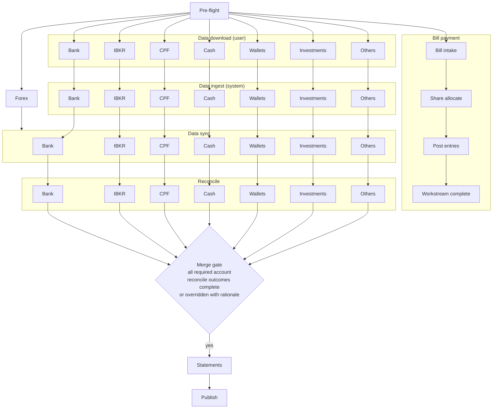

# Workflow Orchestration

## Table of contents

- [Purpose and boundary](#purpose-and-boundary)
- [Reference documents](#reference-documents)
- [Primary scope](#primary-scope)
- [Out of scope](#out-of-scope)
- [Stage model for monthly close](#stage-model-for-monthly-close)
- [Workflow orchestration diagram](#workflow-orchestration-diagram)
- [Account-level orchestration model](#account-level-orchestration-model)
- [Account-group workflow routes](#account-group-workflow-routes)
- [Parallel workstreams](#parallel-workstreams)
- [Account-level dependency rules by group](#account-level-dependency-rules-by-group)
- [Stage entry criteria](#stage-entry-criteria)
- [Mapping completeness gates](#mapping-completeness-gates)
- [Stage exit criteria](#stage-exit-criteria)
- [Stage inputs](#stage-inputs)
- [Stage outputs](#stage-outputs)
- [Stage invariants](#stage-invariants)
- [Stage completion override policy](#stage-completion-override-policy)
- [Rerun and resume behavior](#rerun-and-resume-behavior)
- [Inter-stage dependencies and handoff rules](#inter-stage-dependencies-and-handoff-rules)

## Purpose and boundary

This document defines requirements for monthly-close workflow orchestration.

## Reference documents

- [current workflow](../../../reference/current-workflow.md)	
- [interaction and approvals](interaction-approvals.md)
- [statements lifecycle](statements-lifecycle.md)
- [source systems and lineage](source-systems-lineage.md)
- [exception and error handling](exception-error-handling.md)
- [transaction categories](transaction-categories.md)
- [account classification](account-classification.md)

## Primary scope

- Stage ordering and orchestration rules
- Stage entry and exit criteria
- Mapping completeness gates for category classification and account asset type assignment
- Stage invariants and handoff rules
- Rerun and resume behavior
- Account-group-specific stage routing and dependency gates
- Source-ingestion checkpoint for reconcile readiness
- Bill payment and shared-cost settlement as an independent parallel workstream

## Out of scope

- User approval authority and rejection flow
- Statement revision and publication lifecycle policy
- Exception-policy details and remediation policy

## Stage model for monthly close

| id | stage          | objective                                                         |
| -- | -------------- | ----------------------------------------------------------------- |
| 01 | pre-flight     | validate inputs, environment, and sources                         |
| 02 | forex          | load and validate period exchange rates                           |
| 03 | data download  | user downloads files to Downloads/ and enters GS UI data          |
| 04 | data ingest    | system detects, stages, validates, and provides per-account feedback |
| 05 | data sync      | process staged inputs and refresh app-managed source tables       |
| 06 | reconcile      | execute reconcile checks and close gaps                           |
| 07 | statements     | update and validate statement outputs                             |
| 08 | publish        | produce period artifacts and close session                        |

## Account-level orchestration model

The monthly close executes at the account level. Each account in scope maintains its own workflow state through phase 2 (data download, data ingest, data sync, and reconcile). Accounts within the same group execute the same workflow template but progress independently.

Account groups serve as structural and routing classifications. A group defines the data source type and access method, the parsing profile applied during data sync, the reconcile method applied during reconcile, and the route gate entry criteria for each stage.

The orchestrator tracks workflow state at the account level. The aggregate session status for each phase 2 stage is the composite of all in-scope account statuses. A stage is session-complete only when all in-scope accounts have reached that stage's exit criteria.

The merge gate before statements evaluates individual account-level reconcile outcomes. All accounts must be reconcile-closed or explicitly overridden with logged rationale before statements may begin.

## Workflow orchestration diagram

Each node in the per-group subgraphs represents all accounts of that type running in parallel. Account groups provide the workflow template; individual accounts are the execution unit.

## Account-group workflow routes

Each row defines the stage route and reconcile gate for accounts of that group type. Routes apply at the account level; accounts within the same group progress independently.

| id | account group           | stage route                              | reconcile gate                                 |
| -- | ----------------------- | ---------------------------------------- | ---------------------------------------------- |
| 01 | bank statement accounts | pf > (fx \| dd > di) > ds > rc > st > pb | statement ingest and bridge complete           |
| 02 | ibkr accounts           | pf > (fx \| dd > di) > ds > rc > st > pb | csv parse and nav derivation complete          |
| 03 | cpf accounts            | pf > (fx \| dd > di) > ds > rc > st > pb | GS UI entry confirmed and roll-forward pass    |
| 04 | cash accounts           | pf > (fx \| dd > di) > ds > rc > st > pb | close balance and gap decision logged          |
| 05 | wallets                 | pf > (fx \| dd > di) > ds > rc > st > pb | observed balance and delta review complete     |
| 06 | investments             | pf > (fx \| dd > di) > ds > rc > st > pb | pricing input and valuation reconcile complete |
| 07 | others                  | pf > (fx \| dd > di) > ds > rc > st > pb | source-specific checks and reconcile complete  |

- Route token legend: `pf` pre-flight, `fx` forex, `dd` data download, `di` data ingest, `ds` data sync, `rc` reconcile, `st` statements, `pb` publish.
- `(fx | dd > di)` means forex and data download run in parallel after pre-flight. Data ingest follows data download for each account. Both forex and data ingest must complete before data sync can begin for an account.

## Parallel workstreams

| id | stage            | objective                                    |
| -- | ---------------- | -------------------------------------------- |
| 01 | bill intake      | collect and validate bill inputs             |
| 02 | share allocate   | derive shared-cost split and settlement data |
| 03 | post entries     | post payment and settlement entries          |
| 04 | workstream close | publish bill-workstream completion status    |

- Bill payment and shared-cost settlement run as one parallel workstream during the close session.
- This workstream starts after pre-flight and progresses independently of account-group data sync and reconcile progression.
- Completion of this workstream is tracked separately and does not gate reconcile, statements, or publish in the main accounts workflow.
- Canonical bill, shared-cost, settlement, and consumption state is stored in the app `bills` schema.
- During POC, Google Sheets is used only as a bridge UI for user input and review in this workstream.
- Detailed settlement and allocation policy remains owned by docs/requirements/bill-payment.md and docs/requirements/shared-costs.md.

## Account-level dependency rules by group

The following rules define the data download and data ingest requirements for each account group. Each rule applies per account — an account's data sync may begin once its own data download and data ingest are complete and forex is complete, regardless of the status of other accounts.

- Bank accounts require statement file download to Downloads/ during data download, and system file detection, staging, and format validation during data ingest. See [bank-statements.md](bank-statements.md) for input format and parsing requirements.
- IBKR accounts require activity-statement CSV download to Downloads/ during data download, and system CSV detection, staging, and section validation during data ingest.
- CPF accounts require GS UI sub-account balance entry during data download, and GS adapter read of confirmed entries during data ingest.
- Cash accounts require GS UI close-balance entry during data download, and GS adapter read plus cash-form transaction pull during data ingest.
- Wallet accounts require GS UI observed-balance entry during data download, and GS adapter read of confirmed entries during data ingest.
- Investment accounts require GS UI pricing and quantity entry during data download, and GS adapter read of confirmed entries during data ingest.
- Other accounts require their declared source-specific inputs during data download and source-specific staging and validation during data ingest.
- Forex stage is required before data sync for all in-scope accounts.
- Data download runs in parallel with forex after pre-flight and does not depend on forex success.
- Data ingest runs per account after its data download is complete and does not depend on forex success.
- Reconcile may proceed only when every in-scope account has satisfied its data sync route gate.

## Stage entry criteria

Global sequencing gates:

- Pre-flight entry requires selected target period.
- Forex entry requires pre-flight success.
- Data download entry requires pre-flight success.
- Data ingest entry requires data download completion for the account.
- Data sync entry requires both forex completion and data ingest completion for the account.
- Statements entry requires reconcile success for all required in-scope accounts.
- Publish entry requires statements success.
- During data download, data ingest, data sync, and reconcile, account-level progression is independent. Different accounts may be at different internal stages in parallel.
- Statements is the convergence point where all per-account workstreams merge into one statement-publication path.

Account-level route gates:

- Reconcile entry requires route-gate completion for each in-scope account.
- Reconcile stage remains open while in-scope accounts continue progressing. It closes only when all required account-level route gates are satisfied.

## Mapping completeness gates

- Reconcile entry requires category classification completeness: all active HomeBudget categories must have a `gl_code` entry in the category data model.
- Reconcile entry requires account asset type completeness: all active accounts must have an asset type assignment in the account registry.
- If either completeness gate is not satisfied, the reconcile stage is blocked and the user must resolve the missing classification before reconcile can begin.
- Category and account classification updates are event-driven and operate outside the main monthly close run. Monthly close consumes the approved classification state at the time of execution and does not trigger classification updates.

## Stage exit criteria

Global stage exits:

- A stage exits only when required conditions are satisfied.
- A stage exit records status, timestamp, and key artifacts.
- A stage with unresolved blocking checks cannot exit.
- Data download, data ingest, data sync, and reconcile are all tracked at the account level. Session-level stage status is the aggregate across all in-scope accounts.

Account-level stage exits:

- Each account progresses through data download independently. An account's data ingest may begin once its own download-ready status is set, regardless of other accounts' download status.
- Data download exits per account when required files are available in Downloads/ or GS UI entries are confirmed for that account.
- Data ingest exits per account when staged files are validated and lineage anchors are recorded, or GS UI entries are confirmed via GS adapter.
- Data sync exits per account only when route gate conditions are met or an approved explicit skip state is recorded.
- Reconcile exits per account only when the account route gate is closed and unresolved blocking variance is not present.
- Reconcile exits per account only when edits and semantic pairing and transfer-expense pairing reviews are resolved, approved, or explicitly rejected with logged rationale.
- Session-level data download is complete when all in-scope accounts have reached download-ready status.
- Session-level reconcile is complete when all in-scope accounts are reconcile-closed or overridden.

## Stage inputs

| id | stage       | required inputs                                                   |
| -- | ----------- | ----------------------------------------------------------------- |
| 01 | pre-flight  | target period selection, environment configuration                |
| 02 | forex       | pre-flight success status, target period                          |
| 03 | data ingest | pre-flight success, source website access, GS UI session ready    |
| 04 | data sync   | forex completion, data ingest completion, confirmed GS UI entries |
| 05 | reconcile   | data sync route-gate completion, hb sync state, stm twin state    |
| 06 | statements  | reconcile success status for all required account groups          |
| 07 | publish     | completed user statement review and approval                      |

Data ingest inputs detail:

- Source website access: user authenticates with each bank, broker, and CPF portal to download files.
- Statement files: downloaded bank statement files for the four digital twin accounts and IBKR activity CSVs.
- GS UI session ready: closing-session Google Sheets workbook is open and the target period is set.
- Cash form pull: cash-form transaction records are pulled from the GS cash form for the period alongside the close-balance entry.
- Investment inputs: GS UI entries include unit pricing and user-entered quantity per investment holding.

Data sync is fully app-driven once data ingest is complete. For HomeBudget-sourced data, data sync reads the source system through the wrapper and refreshes hb schema objects defined in [data-model.md](data-model.md). No further user action is required until reconcile review.

## Stage outputs

| id | stage         | produced outputs                                                            |
| -- | ------------- | --------------------------------------------------------------------------- |
| 01 | pre-flight    | validated period selection, environment readiness confirmation               |
| 02 | forex         | period exchange rates loaded into the forex rates store                     |
| 03 | data download | download-ready status per account, recorded GS UI entries                   |
| 04 | data ingest   | staged files in ingest dir, lineage anchors, per-account feedback           |
| 05 | data sync     | refreshed hb schema sync state, stm twin records, route-gate statuses       |
| 06 | reconcile     | account closure status, variance log, pairing decisions, staged expense CRUD |
| 07 | statements    | draft income statement and balance sheet for review                         |
| 08 | publish       | finalized PDF statements, S3 upload, session close record                   |

## Stage invariants

- One active top-level stage at a time for a session.
- Stage order is forward-only unless explicit rerun is triggered.
- Each stage must produce deterministic outputs for the same inputs.
- Data download is user-driven and cannot run autonomously.
- Data ingest is app-driven; it begins per account as soon as download-ready status is set and proceeds without user action.
- Data sync is app-driven and proceeds without user action once data ingest is complete per account.
- Within data download, data ingest, data sync, and reconcile, account-level state progression runs in parallel and does not require lockstep advancement across accounts or account groups.

## Stage completion override policy

- Manual override of stage completion status is allowed when a blocking condition is assessed as acceptable by the user.
- POC control model is single-user and lightweight. No additional multi-party approval step is required for stage completion override.
- Override must record stage id, prior status, new status, user identity, timestamp, and concise rationale.
- Override must include explicit acknowledgment of unresolved checks or route-gate gaps for affected account groups.
- Override does not remove lineage requirements. The session record must retain both original gate outcomes and the override decision.

## Rerun and resume behavior

- Rerun restarts at a selected stage and invalidates downstream stage outputs.
- Resume continues from last incomplete stage with preserved prior stage outputs.
- Rerun and resume actions must be logged with user reason.

## Inter-stage dependencies and handoff rules

- Stage outputs are contractual inputs for the next stage.
- Handoff must include success status and lineage reference.
- Failed handoff blocks the next stage from starting.
- Data download handoff records download-ready status per in-scope account.
- Data ingest handoff records staged file completeness, lineage anchors, and GS UI entry confirmation per in-scope account.
- Reconcile-stage handoff includes data sync completion status and account-level route-gate status.
- Reconcile-stage handoff must include account-level route-gate status for accounts in: bank statement accounts, ibkr accounts, cpf accounts, cash accounts, wallets, investments, and others.
- Mixed account progression states inside data download, data ingest, data sync, and reconcile are expected. For example, one account may already be in reconcile while another is still in data download.
- Merge gate before statements: all required account-level reconcile outcomes must be complete, or explicitly overridden with logged rationale.

