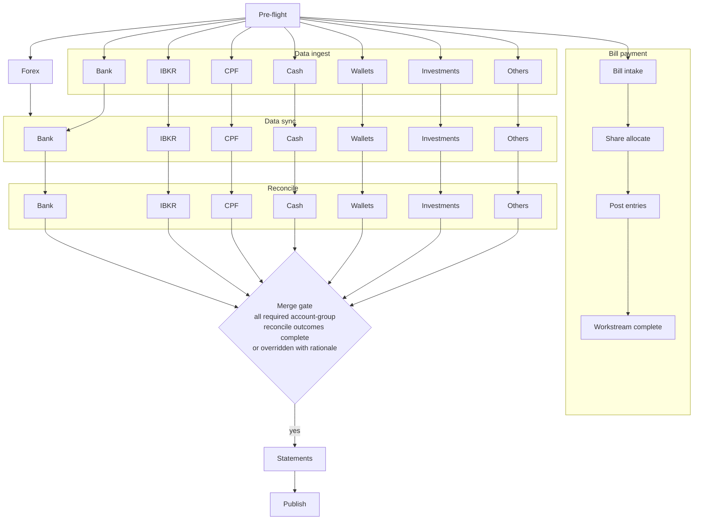

# Workflow Orchestration

## Table of contents

- [Purpose and boundary](#purpose-and-boundary)
- [Reference documents](#reference-documents)
- [Primary scope](#primary-scope)
- [Out of scope](#out-of-scope)
- [Stage model for monthly close](#stage-model-for-monthly-close)
- [Workflow orchestration diagram](#workflow-orchestration-diagram)
- [Account-group workflow routes](#account-group-workflow-routes)
- [Parallel workstreams](#parallel-workstreams)
- [Account-group dependency rules](#account-group-dependency-rules)
- [Stage entry criteria](#stage-entry-criteria)
- [Stage exit criteria](#stage-exit-criteria)
- [Stage inputs](#stage-inputs)
- [Stage outputs](#stage-outputs)
- [Stage invariants](#stage-invariants)
- [Stage completion override policy](#stage-completion-override-policy)
- [Rerun and resume behavior](#rerun-and-resume-behavior)
- [Inter-stage dependencies and handoff rules](#inter-stage-dependencies-and-handoff-rules)

## Purpose and boundary

This document defines requirements for monthly-close workflow orchestration.

## Reference documents

- [current workflow](../reference/current-workflow.md)	
- [interaction and approvals](interaction-approvals.md)
- [statements lifecycle](statements-lifecycle.md)
- [source systems and lineage](source-systems-lineage.md)
- [exception and error handling](exception-error-handling.md)

## Primary scope

- Stage ordering and orchestration rules
- Stage entry and exit criteria
- Stage invariants and handoff rules
- Rerun and resume behavior
- Account-group-specific stage routing and dependency gates
- Source-ingestion checkpoint for reconcile readiness
- Bill payment and shared-cost settlement as an independent parallel workstream

## Out of scope

- User approval authority and rejection flow
- Statement revision and publication lifecycle policy
- Exception-policy details and remediation policy

## Stage model for monthly close

| id | stage       | objective                                                  |
| -- | ----------- | ---------------------------------------------------------- |
| 01 | pre-flight  | validate inputs, environment, and sources                  |
| 02 | forex       | load and validate period exchange rates                    |
| 03 | data ingest | user authenticates sources, downloads files, enters GS UI  |
| 04 | data sync   | process ingested inputs and refresh app-managed source tables |
| 05 | reconcile   | execute reconcile checks and close gaps                    |
| 06 | statements  | update and validate statement outputs                      |
| 07 | publish     | produce period artifacts and close session                 |

## Workflow orchestration diagram

## Account-group workflow routes

| id | account group           | stage route                         | reconcile gate                              |
| -- | ----------------------- | ----------------------------------- | ------------------------------------------- |
| 01 | bank statement accounts | pf > (fx \| di) > ds > rc > st > pb | statement ingestion and bridge complete     |
| 02 | ibkr accounts           | pf > (fx \| di) > ds > rc > st > pb | csv parse and nav derivation complete       |
| 03 | cpf accounts            | pf > (fx \| di) > ds > rc > st > pb | GS UI entry confirmed and roll-forward pass |
| 04 | cash accounts           | pf > (fx \| di) > ds > rc > st > pb | close balance and gap decision logged       |
| 05 | wallets                 | pf > (fx \| di) > ds > rc > st > pb | observed balance and delta review complete  |
| 06 | investments             | pf > (fx \| di) > ds > rc > st > pb | pricing input and valuation reconcile complete |
| 07 | others                  | pf > (fx \| di) > ds > rc > st > pb | source-specific checks and reconcile complete |

- Route token legend: `pf` pre-flight, `fx` forex, `di` data ingest, `ds` data sync, `rc` reconcile, `st` statements, `pb` publish.
- `(fx | di)` means forex and data ingest run in parallel after pre-flight; both must complete before data sync can begin.

## Parallel workstreams

| id | stage           | objective                                    |
| -- | --------------- | -------------------------------------------- |
| 01 | bill intake     | collect and validate bill inputs             |
| 02 | share allocate  | derive shared-cost split and settlement data |
| 03 | post entries    | post payment and settlement entries          |
| 04 | workstream close | publish bill-workstream completion status    |

- Bill payment and shared-cost settlement run as one parallel workstream during the close session.
- This workstream starts after pre-flight and progresses independently of account-group data sync and reconcile progression.
- Completion of this workstream is tracked separately and does not gate reconcile, statements, or publish in the main accounts workflow.
- Canonical bill, shared-cost, settlement, and consumption state is stored in the app `bills` schema.
- During POC, Google Sheets is used only as a bridge UI for operator input and review in this workstream.
- Detailed settlement and allocation policy remains owned by docs/requirements/bill-payment.md and docs/requirements/shared-costs.md.

## Account-group dependency rules

- Bank statement-process accounts require statement file download during data ingest and statement-file processing into the statement digital twin during data sync.
- IBKR accounts require activity-statement CSV download during data ingest and CSV parsing with top-down NAV derivation during data sync.
- CPF accounts require GS UI sub-account entry during data ingest and roll-forward computation during data sync.
- Cash accounts require GS UI close-balance entry and cash-form transaction pull during data ingest, and cash-form transaction aggregation during data sync.
- Wallet accounts require GS UI observed-balance entry during data ingest and computed adjustment preview during data sync.
- Investment accounts require GS UI pricing input and quantity input during data ingest and valuation snapshot computation during data sync.
- Other accounts require their declared source-specific inputs during data ingest and source-specific checks during data sync.
- Forex stage is required before data sync for all in-scope account groups.
- Data ingest runs in parallel with forex after pre-flight and does not depend on forex success.
- Reconcile may proceed only when every in-scope account group has satisfied its route gate.

## Stage entry criteria

Global sequencing gates:

- Pre-flight entry requires selected target period.
- Forex entry requires pre-flight success.
- Data ingest entry requires pre-flight success.
- Data sync entry requires both forex completion and data ingest completion.
- Statements entry requires reconcile success for all required in-scope account groups.
- Publish entry requires statements success.
- During data ingest, data sync, and reconcile, account-level progression is independent. Different accounts may be at different internal stages in parallel.
- Statements is the convergence point where account-specific workstreams merge into one statement-publication path.

Account-group route gates:

- Reconcile entry requires route-gate completion for each in-scope account group.
- Reconcile stage remains open while in-scope accounts continue progressing. It closes only when all required account-group route gates are satisfied.

## Stage exit criteria

Global stage exits:

- A stage exits only when required conditions are satisfied.
- A stage exit records status, timestamp, and key artifacts.
- A stage with unresolved blocking checks cannot exit.
- Data ingest, data sync, and reconcile are all tracked at account-group level. Session-level stage status is the aggregate across all in-scope account groups.

Account-group stage exits:

- Each account group progresses through data ingest independently. An account group's data sync may begin once its own ingest is complete and forex is complete, regardless of other account groups' ingest status.
- Data ingest exits when all required statement files are downloaded and all required GS UI entries are confirmed for in-scope account groups.
- Data sync exits only when each in-scope account group has completed its route gate or has an approved explicit skip state.
- Reconcile exits only when all account-group route gates are closed and group-level unresolved blocking variance is not present.

## Stage inputs

| id | stage       | required inputs                                                 |
| -- | ----------- | --------------------------------------------------------------- |
| 01 | pre-flight  | target period selection, environment configuration              |
| 02 | forex       | pre-flight success status, target period                        |
| 03 | data ingest | pre-flight success, source website access, GS UI session ready  |
| 04 | data sync   | forex completion, data ingest completion, confirmed GS UI entries|
| 05 | reconcile   | data sync route-gate completion, hb sync state, stm twin state|
| 06 | statements  | reconcile success status for all required account groups        |
| 07 | publish     | completed user statement review and approval                    |

Data ingest inputs detail:

- Source website access: user authenticates with each bank, broker, and CPF portal to download files.
- Statement files: downloaded bank statement files for the four digital twin accounts and IBKR activity CSVs.
- GS UI session ready: closing-session Google Sheets workbook is open and the target period is set.
- Cash form pull: cash-form transaction records are pulled from the GS cash form for the period alongside the close-balance entry.
- Investment inputs: GS UI entries include unit pricing and user-entered quantity per investment holding.

Data sync is fully app-driven once data ingest is complete. For HomeBudget-sourced data, data sync reads the source system through the wrapper and refreshes hb schema objects defined in [data-model.md](data-model.md). No further user action is required until reconcile review.

## Stage outputs

| id | stage       | produced outputs                                                |
| -- | ----------- | --------------------------------------------------------------- |
| 01 | pre-flight  | validated period selection, environment readiness confirmation  |
| 02 | forex       | period exchange rates loaded into the forex rates store         |
| 03 | data ingest | downloaded statement files, confirmed GS UI entries per account |
| 04 | data sync   | refreshed hb schema sync state, stm twin records, route-gate statuses |
| 05 | reconcile   | reconcile gate status per account group, variance log           |
| 06 | statements  | draft income statement and balance sheet for review             |
| 07 | publish     | finalized PDF statements, S3 upload, session close record       |

## Stage invariants

- One active top-level stage at a time for a session.
- Stage order is forward-only unless explicit rerun is triggered.
- Each stage must produce deterministic outputs for the same inputs.
- Data ingest is user-driven and cannot run autonomously. Data sync is app-driven and proceeds without user action once data ingest is complete.
- Within data sync and reconcile, account-level state progression may run in parallel and does not require lockstep advancement across accounts.

## Stage completion override policy

- Manual override of stage completion status is allowed when a blocking condition is assessed as acceptable by the user.
- POC control model is single-user and lightweight. No additional multi-party approval step is required for stage completion override.
- Override must record stage id, prior status, new status, user identity, timestamp, and concise rationale.
- Override must include explicit acknowledgment of unresolved checks or route-gate gaps for affected account groups.
- Override does not remove lineage requirements. The session record must retain both original gate outcomes and the override decision.

## Rerun and resume behavior

- Rerun restarts at a selected stage and invalidates downstream stage outputs.
- Resume continues from last incomplete stage with preserved prior stage outputs.
- Rerun and resume actions must be logged with user reason.

## Inter-stage dependencies and handoff rules

- Stage outputs are contractual inputs for the next stage.
- Handoff must include success status and lineage reference.
- Failed handoff blocks the next stage from starting.
- Data ingest handoff records statement-file completeness and GS UI entry confirmation per in-scope account group.
- Reconcile-stage handoff includes data sync completion status and account-group route-gate status.
- Reconcile-stage handoff must include account-group route-gate status for bank statement accounts, ibkr accounts, cpf accounts, cash accounts, wallets, investments, and others.
- Mixed account progression states inside data sync and reconcile are expected. For example, one account may already be in reconcile while another account is still in data sync or not started.
- Merge gate before statements: all required account-group reconcile outcomes must be complete, or explicitly overridden with logged rationale.

