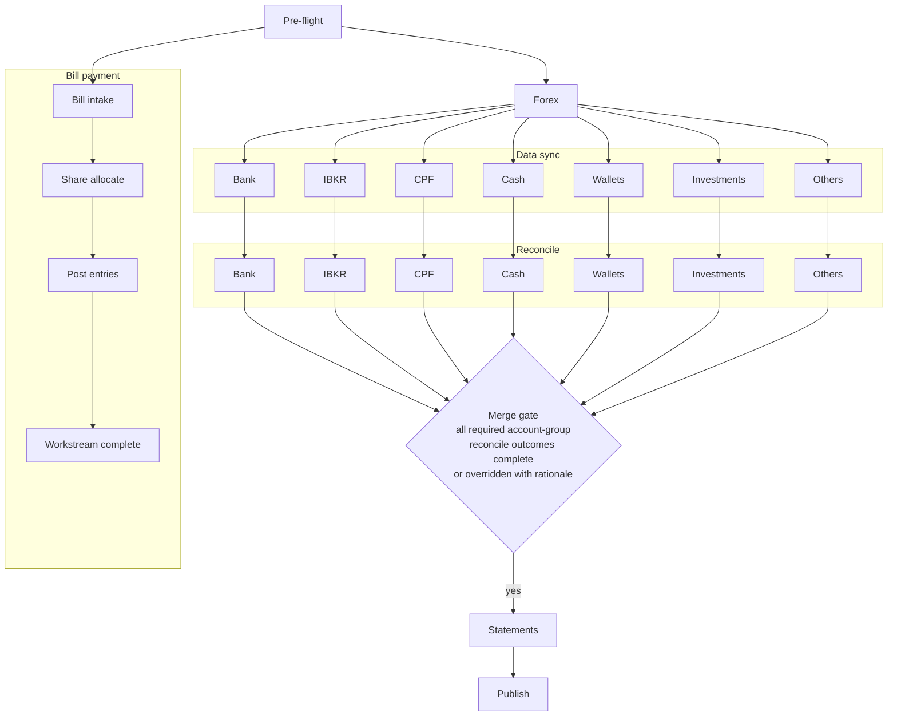

# Workflow Orchestration

## Table of contents

- [Purpose and boundary](#purpose-and-boundary)
- [Reference documents](#reference-documents)
- [Primary scope](#primary-scope)
- [Out of scope](#out-of-scope)
- [Stage model for monthly close](#stage-model-for-monthly-close)
- [Workflow orchestration diagram](#workflow-orchestration-diagram)
- [Account-group workflow routes](#account-group-workflow-routes)
- [Parallel workstreams](#parallel-workstreams)
- [Account-group dependency rules](#account-group-dependency-rules)
- [Stage entry criteria](#stage-entry-criteria)
- [Stage exit criteria](#stage-exit-criteria)
- [Stage invariants](#stage-invariants)
- [Stage completion override policy](#stage-completion-override-policy)
- [Rerun and resume behavior](#rerun-and-resume-behavior)
- [Inter-stage dependencies and handoff rules](#inter-stage-dependencies-and-handoff-rules)

## Purpose and boundary

This page is the normative owner for monthly-close workflow orchestration.

## Reference documents

- [current workflow](current-workflow.md)	
- [interaction and approvals](interaction-approvals.md)
- [statements lifecycle](statements-lifecycle.md)
- [source systems and lineage](source-systems-lineage.md)
- [exception and error handling](exception-error-handling.md)

## Primary scope

- Stage ordering and orchestration rules
- Stage entry and exit criteria
- Stage invariants and handoff rules
- Rerun and resume behavior
- Account-group-specific stage routing and dependency gates
- Source-ingestion checkpoint for reconcile readiness
- Bill payment and shared-cost settlement as an independent parallel workstream

## Out of scope

- User approval authority and rejection flow
- Statement revision and publication lifecycle policy
- Exception-policy details and remediation policy

## Stage model for monthly close

| id | stage      | objective                                         |
| -- | ---------- | ------------------------------------------------- |
| 01 | pre-flight | validate inputs, environment, and sources         |
| 02 | forex      | load and validate period exchange rates           |
| 03 | data sync  | ingest source inputs and update source-ledger datasets |
| 04 | reconcile  | execute reconcile checks and close gaps           |
| 05 | statements | update and validate statement outputs             |
| 06 | publish    | produce period artifacts and close session        |

## Workflow orchestration diagram

## Account-group workflow routes

| id | account group           | stage route                 | reconcile gate                          |
| -- | ----------------------- | --------------------------- | --------------------------------------- |
| 01 | bank statement accounts | pf > fx > ds > rc > st > pb | statement ingestion and bridge complete |
| 02 | ibkr accounts           | pf > fx > ds > rc > st > pb | csv parse and nav derivation complete   |
| 03 | cpf accounts            | pf > fx > ds > rc > st > pb | json input and roll-forward pass        |
| 04 | cash accounts           | pf > fx > ds > rc > st > pb | close balance and gap decision logged   |
| 05 | wallets                 | pf > fx > ds > rc > st > pb | observed balance and delta review complete |
| 06 | investments             | pf > fx > ds > rc > st > pb | pricing input and valuation reconcile complete |
| 07 | others                  | pf > fx > ds > rc > st > pb | source-specific checks and reconcile complete |

- Route token legend: `pf` pre-flight, `fx` forex, `ds` data sync, `rc` reconcile, `st` statements, `pb` publish.

## Parallel workstreams

| id | stage           | objective                                    |
| -- | --------------- | -------------------------------------------- |
| 01 | bill intake     | collect and validate bill inputs             |
| 02 | share allocate  | derive shared-cost split and settlement data |
| 03 | post entries    | post payment and settlement entries          |
| 04 | workstream close | publish bill-workstream completion status    |

- Bill payment and shared-cost settlement run as one parallel workstream during the close session.
- This workstream starts after pre-flight and progresses independently of account-group data sync and reconcile progression.
- Completion of this workstream is tracked separately and does not gate reconcile, statements, or publish in the main accounts workflow.
- Detailed settlement and allocation policy remains owned by docs/requirements/bill-payment.md and docs/requirements/bill-payment-shared-costs.md.

## Account-group dependency rules

- Bank statement-process accounts depend on statement-file ingestion into the statement digital twin during data sync.
- IBKR accounts depend on activity-statement CSV parsing and top-down derivation from Net Asset Value and Cash Report during data sync.
- CPF accounts depend on operator-entered monthly JSON inputs and sub-account roll-forward checks during data sync.
- Cash accounts depend on operator close-balance input and cash-form transaction aggregation during data sync.
- Wallet accounts depend on observed-balance inputs and computed adjustment previews during data sync.
- Investment accounts depend on pricing inputs and valuation snapshots during data sync.
- Other accounts depend on their declared source-specific input checks during data sync.
- Forex stage is required before data sync for all in-scope account groups.
- Reconcile may proceed only when every in-scope account group has satisfied its route gate.

## Stage entry criteria

Global sequencing gates:

- Pre-flight entry requires selected target period.
- Forex entry requires pre-flight success.
- Data sync entry requires forex success.
- Statements entry requires reconcile success for all required in-scope account groups.
- Publish entry requires statements success.
- During data sync and reconcile, account-level progression is independent. Different accounts may be at different internal stages in parallel.
- Statements is the convergence point where account-specific workstreams merge into one statement-publication path.

Account-group route gates:

- Reconcile entry requires route-gate completion for each in-scope account group.
- Reconcile stage remains open while in-scope accounts continue progressing. It closes only when all required account-group route gates are satisfied.

## Stage exit criteria

Global stage exits:

- A stage exits only when required conditions are satisfied.
- A stage exit records status, timestamp, and key artifacts.
- A stage with unresolved blocking checks cannot exit.
- Data sync and reconcile stage status is session-level aggregate status based on account-level progression states.

Account-group stage exits:

- Data sync exits only when each in-scope account group has completed its route gate or has an approved explicit skip state.
- Reconcile exits only when all account-group route gates are closed and group-level unresolved blocking variance is not present.

## Stage invariants

- One active top-level stage at a time for a session.
- Stage order is forward-only unless explicit rerun is triggered.
- Each stage must produce deterministic outputs for the same inputs.
- Within data sync and reconcile, account-level state progression may run in parallel and does not require lockstep advancement across accounts.

## Stage completion override policy

- Manual override of stage completion status is allowed when a blocking condition is assessed as acceptable by the operator.
- POC control model is single-user and lightweight. No additional multi-party approval step is required for stage completion override.
- Override must record stage id, prior status, new status, operator identity, timestamp, and concise rationale.
- Override must include explicit acknowledgment of unresolved checks or route-gate gaps for affected account groups.
- Override does not remove lineage requirements. The session record must retain both original gate outcomes and the override decision.

## Rerun and resume behavior

- Rerun restarts at a selected stage and invalidates downstream stage outputs.
- Resume continues from last incomplete stage with preserved prior stage outputs.
- Rerun and resume actions must be logged with operator reason.

## Inter-stage dependencies and handoff rules

- Stage outputs are contractual inputs for the next stage.
- Handoff must include success status and lineage reference.
- Failed handoff blocks the next stage from starting.
- Reconcile-stage handoff includes source-ingestion readiness and account-group route-gate status.
- Reconcile-stage handoff must include account-group route-gate status for bank statement accounts, ibkr accounts, cpf accounts, cash accounts, wallets, investments, and others.
- Mixed account progression states inside data sync and reconcile are expected. For example, one account may already be in reconcile while another account is still in data sync or not started.
- Merge gate before statements: all required account-group reconcile outcomes must be complete, or explicitly overridden with logged rationale.

